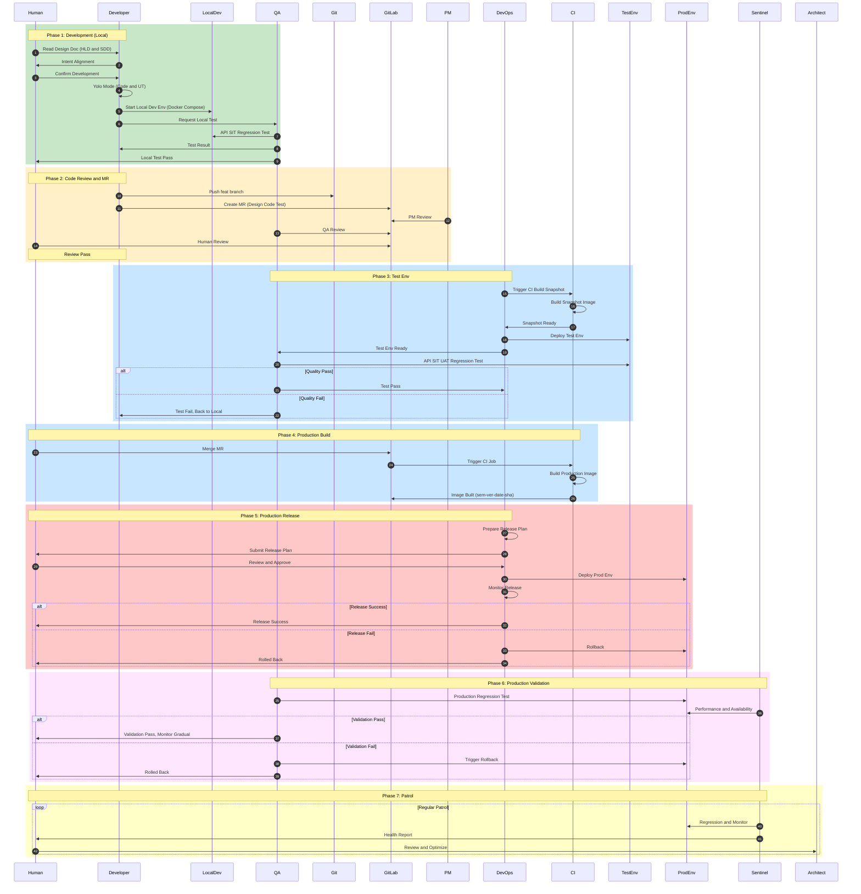

# AI-Native 开发操作手册

> **基于 Agent Team Archetype 原型工程的快速上手指南**

**目标读者**: 已了解 AI-Native 开发理念，希望快速使用原型工程进行开发的人
**前置阅读**: 如需了解 AI-Native 开发理念和方法论，请参阅 [AI-Native Development Guide Book](docs/guides/ai_native_development_guide_book.md)

**版本**: v2.0
**更新日期**: 2026-04-29

---

## 目录

- [Agent Team 协作原理](#agent-team-协作原理)
- [快速开始](#快速开始)
- [Part 1: 环境准备](#part-1-环境准备)
- [Part 2: 设计阶段](#part-2-设计阶段)
- [Part 3: 开发阶段](#part-3-开发阶段)
- [Part 4: 测试阶段](#part-4-测试阶段)
- [Part 5: 发布阶段](#part-5-发布阶段)
- [Part 6: 持续管理](#part-6-持续管理)
- [附录](#附录)

---

## Agent Team 协作原理

### 核心理念

AI-Native 开发基于**多角色 AI Agent 协作**模式，每个 Agent 承担软件开发中的特定角色，通过专业化分工实现高质量、高效率的工程开发。

**人类角色转变**：
- ✅ 从"实现者"转变为"设计者"和"验收者"
- ✅ 专注于需求、设计、技术方案和验收标准
- ❌ 不再深入复杂的代码实现细节

**AI Agent 角色**：
- ✅ 承担代码实现、测试、发布等执行工作
- ✅ 提供快速验证和迭代能力
- ✅ 基于人类设计进行自主开发

### Agent Team 角色概览

| 角色 | 技能 | 主要职责 | 输出 |
|------|------|---------|------|
| **架构师** | `/arch` | 系统架构设计、技术选型、设计文档审查 | Design Doc (HLD) |
| **项目经理** | `/pm` | Story 拆解、排期规划、SDD 生成、进度跟踪 | SDD + 行动计划 |
| **开发者** | `/dev` | 代码实现、单元测试、API 测试、本地自测 | Code + UT + API Tests |
| **质量工程师** | `/qa` | SIT/UAT 测试、质量保障、测试覆盖率分析 | Test Report |
| **运维工程师** | `/devops` | 发布计划、环境搭建、监控告警、回滚执行 | Deployment Plan |
| **哨兵** | `/sentinel` | 定期巡检、回归测试、性能分析、健康检查 | Health Report |

### 协作流程图

```mermaid
graph TB
    Start([Project Start]) --> Human[Human]

    %% Design Phase
    Human --> |Requirements| Architect[Architect]
    Architect --> |HLD| ProjectManager[ProjectManager]
    ProjectManager --> |SDD| DesignDone{Design Done}

    %% Development Phase
    DesignDone --> Developer[Developer]
    Developer --> |Align| Align[Human Confirm]
    Align --> |Confirm| YOLO[YOLO Mode]
    YOLO --> |Code UT| LocalDev[Local Dev Env]
    LocalDev --> |Docker Compose| LocalQA[QA]
    LocalQA --> |API SIT Test| LocalTest{Local Test Pass}
    LocalTest --> |No| YOLO
    LocalTest --> |Yes| PushMR[Push MR]

    %% Code Review Phase (PM + QA + Human)
    PushMR --> Review[Code Review]
    Review --> |PM Review| RevPM[PM]
    Review --> |QA Review| RevQA[QA]
    Review --> |Human Review| RevHuman[Human]
    RevPM --> ReviewPass{Review Pass}
    RevQA --> ReviewPass
    RevHuman --> ReviewPass
    ReviewPass --> |Yes| DevOps[DevOps]
    ReviewPass --> |No| Developer

    %% Test Env (DevOps -> CI Build Snapshot -> Deploy Test Env -> QA Test)
    DevOps --> CIBuild[CI Build Snapshot]
    CIBuild --> |Snapshot Image| DeployTest[Deploy Test Env]
    DeployTest --> QATest[QA Regression Test]
    QATest --> |API SIT UAT| TestQuality{Quality Pass}
    TestQuality --> |No| Developer
    TestQuality --> |Yes| MRMerge[MR Merge]

    %% Production Build
    MRMerge --> CIProd[CI Build Production]
    CIProd --> |Production Image| PreparePlan[Prepare Release Plan]

    %% Production Release (Release Plan -> Human Review -> Deploy Prod Env)
    PreparePlan --> HumanReview[Human Review]
    HumanReview --> |Approve| DeployProd[Deploy Prod Env]
    HumanReview --> |Reject| PreparePlan
    DeployProd --> Monitor{Deploy Success}
    Monitor --> |No| Rollback[Rollback]
    Monitor --> |Yes| ProdValid[Prod Validation]

    %% Production Validation Phase
    ProdValid --> QASentinel[QA Sentinel]
    QASentinel --> |Regression Test| Validation{Validation Pass}
    Validation --> |No| Rollback
    Validation --> |Yes| Stable[Stable]

    %% Continuous Patrol Phase
    Stable --> Sentinel[Sentinel]
    Sentinel --> |Patrol| HealthReport[Health Report]
    HealthReport --> Human
    Human --> |Optimize| Architect

    style Architect fill:#e1f5ff
    style ProjectManager fill:#fff3e0
    style Developer fill:#e8f5e9
    style DevOps fill:#f3e5f5
    style Sentinel fill:#fff9c4
    style Human fill:#ffccbc

    classDef agentRole fill:#e1f5ff,#fff3e0,#e8f5e9,#fce4ec,#f3e5f5,#fff9c4
    class Architect,ProjectManager,Developer,DevOps,Sentinel agentRole
```



**注**：上图展示 AI-Native 开发的宏观流程，详细的角色交互和时序关系请参见下方[时序图](#时序图sequence-diagram)。

### 时序图（Sequence Diagram）

以下时序图展示 AI-Native 开发的完整角色交互过程，包含 7 个主要阶段。



**时序图说明**：
- **Phase 1 (Development)**: Local development and validation, including intent alignment, Yolo Mode, Local Dev Env testing
- **Phase 2 (Code Review and MR)**: Create MR, PM and QA and Human review code
- **Phase 3 (Test Env)**: DevOps triggers CI Build Snapshot, Deploy Test Env, run full regression tests, quality gate check
- **Phase 4 (Production Build)**: Build production image after MR merge
- **Phase 5 (Production Release)**: DevOps prepares Release Plan, Human Review, Deploy Prod Env, including rollback mechanism
- **Phase 6 (Production Validation)**: Production regression test and gradual rollout observation
- **Phase 7 (Patrol)**: Sentinel regular patrol and health report

**关键反馈循环**：
- 测试环境质量不满足 → 回到本地开发修复
- 生产发布失败 → 回滚到上一版本
- 生产验证失败 → 触发回滚

---

### 完整工作流程

#### 阶段 1: 设计阶段（人类主导）

```
人类需求 → /arch 生成概要设计（HLD） → /pm 拆解 Story 生成详细设计（SDD） → 设计完成
```

#### 阶段 2: 开发阶段（本地）

```
设计文档 → /dev 意图对齐 → Human Confirm → /dev Yolo Mode 开发（Code + UT）
→ Local Dev Env 验证 → /qa 本地 API/SIT 回归测试 → 测试通过
```

#### 阶段 3: 提测阶段（MR）

```
本地测试通过 → 推送 feat branch → 创建 MR（Design + Code + Test）
→ CI 构建快照镜像（:snapshot-mr-<iid>）
```

#### 阶段 4: 测试环境验证

```
快照镜像 → /devops 发布到 Test Env（Helm/ArgoCD） → /qa 回归测试（API/SIT/UAT）
→ 质量满足 → MR 合并 → CI 构建生产镜像（:sem_ver-date-sha）
→ 质量不满足 → 回到本地开发修复
```

#### 阶段 5: 生产发布

```
生产镜像 → /devops 准备发布计划（变更/回滚/灰度） → Human Review → 确认发布
→ /devops 执行发布到 Prod Env（Helm/ArgoCD） → 监控发布状态
→ 发布成功 → 生产验证 | 发布失败 → 回滚到上一版本
```

#### 阶段 6: 生产验证

```
发布成功 → /qa 或 /sentinel 生产环境回归测试 → 功能/性能验证 → 观察灰度效果
→ 验证通过 → 稳定运行 | 验证失败 → 触发回滚
```

#### 阶段 7: 日常巡检

```
稳定运行 → /sentinel 定期巡检（回归测试、监控分析） → 生成健康报告
→ Human 审查报告 → 决策优化
```

**注**：以上为高层流程概览，详细的步骤说明请参见[附录 D: 完整研发流程](#appendix-d-完整研发流程)。

### 协作关键点

**1. 设计驱动开发**
- Design Doc 作为 SSOT（唯一真实来源）
- HLD（概要设计）→ SDD（详细设计）→ Code（代码实现）
- Design 一变，Code 和 Test 跟着变

**2. 意图对齐（关键）**
- Agent 开发前必须对齐意图
- 人类确认 Agent 的理解正确性
- 不清晰的意图会导致开发偏差

**3. 三域一致性**
- Design ↔ Scrum ↔ Code ↔ Tests 必须对齐
- 使用 `/spec-xchecker` 验证一致性
- MR 提交前必须验证三域对齐

**4. 并行开发能力**
- 使用 Git Worktree 创建多个独立开发环境
- 每个 Worktree 启动独立的 Claude Code Session
- 多个 Feature 可同时开发、独立测试、独立发布

**5. 质量门禁**
- UT ≥ 50%
- API = 100%
- SIT ≥ 90%
- UAT ≥ 85%
- 三域一致性验证通过

**6. 阶梯发布**
- 本地自测（docker-compose）
- 测试环境（helm publish to test，snapshot 镜像）
- 生产环境（helm publish to prod，生产镜像）
- 每阶段都可回滚

**7. 反馈循环**
- 测试环境质量不满足 → 回到本地开发修复
- 生产发布失败 → 回滚到上一版本
- 生产验证失败 → 触发回滚
- 每个质量门禁都有明确的反馈路径

**8. 镜像策略**
- **快照镜像**（:snapshot-mr-<iid>）：用于测试环境验证，MR 关联
- **生产镜像**（:sem_ver-date-sha）：用于生产环境发布，正式版本

**9. 回滚机制**
- 本地开发失败 → 重新 Yolo Mode 开发
- 测试环境发布失败 → 重新构建快照镜像
- 生产环境发布失败 → 回滚到上一 Helm Release
- 生产环境验证失败 → 触发回滚并分析根因

**10. 时序图说明**
- 上方[时序图](#时序图sequence-diagram)详细展示了 7 个阶段的角色交互
- 包含完整的时间顺序、消息传递和反馈循环
- 每个阶段都有明确的负责角色和验证标准

### 角色协作示例

**场景：开发 Pod 资源管理功能**

```
1. 人类提出需求
   → "需要实现 Pod 资源统计和 GPU 计费功能"

2. /arch: 生成概要设计
   → docs/design/cmdb_design_v4.0.md
   → 数据模型、表结构、索引设计

3. /pm: 拆解 Story
   → docs/scrum/story/story-15-25.md
   → 场景描述、验收标准、执行计划

4. /dev: 意图对齐
   → "我的理解是：需要实现 Pod 资源状态记录..."
   → 人类确认："正确，请开始开发"

5. /dev: YOLO Mode 开发
   → 实现 DAO 层、Service 层、API 层
   → 编写单元测试、API 测试
   → 本地验证通过

6. /dev: Local Dev Env 验证
   → 启动 Docker Compose
   → /qa 本地 API/SIT 回归测试
   → 测试通过

7. /dev: 推送 MR
   → 推送 feat branch
   → 创建 MR（Design + Code + Test）
   → CI 构建快照镜像（:snapshot-mr-30）

8. /devops: 发布到测试环境
   → Helm 发布 snapshot 镜像到 Test Env
   → /qa 测试环境回归测试（API/SIT/UAT）
   → 质量满足

9. Human: 合并 MR
   → CI 构建生产镜像（:V0.1-20260428153000-a1b2c3d）

10. /devops: 发布到生产环境
    → 准备发布计划（变更/回滚/灰度）
    → Human Review 并确认
    → Helm 发布生产镜像到 Prod Env
    → 监控发布状态

11. /qa 或 /sentinel: 生产验证
    → 生产环境回归测试
    → 功能/性能验证
    → 观察灰度效果
    → 验证通过，稳定运行

12. /sentinel: 日常巡检
    → 定期巡检、监控分析
    → 生成健康报告
    → 人类审查报告，决策优化
```

**注**：以上示例为高层流程，详细的步骤说明请参见[附录 D: 完整研发流程](#appendix-d-完整研发流程)。

---

## 快速开始

### 5 分钟快速上手

```bash
# 1. 创建 worktree
git worktree add ../my-feature my-feature-branch

# 2. 进入目录并启动 Claude Code
cd ../my-feature
claude --dangerously-skip-permissions

# 3. 开始开发
Human: /dev，实现 story-15-25
/dev: [自主完成开发任务]
```

**学习路径**：
1. 阅读 [Part 1](#part-1-环境准备) - 搭建开发环境
2. 阅读 [Part 2](#part-2-设计阶段) - 理解设计流程
3. 阅读 [Part 3](#part-3-开发阶段) - 开始第一个 Story
4. 遇到问题查阅 [附录 B: 故障排查](#appendix-b-故障排查)

---

## Part 1: 环境准备

### 1.1 安装依赖

**系统依赖**：

```bash
# Go 1.24+
go version

# Python 3.10+
python3 --version

# Claude Code CLI
claude --version

# Git
git --version
```

**Python 依赖**：

```bash
# 安装项目依赖
pip install -r requirements.txt
# 或使用 uv
uv pip install -r requirements.txt
```

### 1.2 配置 Agent Skills

**验证 Skills 可用性**：

```bash
# 在 Claude Code 中验证
/arch
/pm
/dev
/qa
/devops
/commit
/sentinel
```

**Skills 位置**：
- 全局技能: `~/.claude/skills/`
- 项目技能: `.claude/skills/`

### 1.3 创建 Worktree

**为每个 Feature 创建独立 Worktree**：

```bash
# 创建 worktree
git worktree add ../project-feature-a feature-a
git worktree add ../project-feature-b feature-b
git worktree add ../project-feature-c feature-c

# 查看 worktree 列表
git worktree list

# 删除 worktree（开发完成后）
git worktree remove ../project-feature-a
```

**启动独立的 Claude Code Session**：

```bash
# Terminal 1
cd ../project-feature-a
claude --dangerously-skip-permissions

# Terminal 2（并行开发）
cd ../project-feature-b
claude --dangerously-skip-permissions
```

---

## Part 2: 设计阶段

### 2.1 使用 /arch 生成概要设计

**用途**: 生成系统架构设计文档（HLD）

**操作步骤**：

```bash
# 在 Claude Code 中
/arch: 设计 CMDB 数据层架构，支持 Pod 资源统计和 GPU 计费
```

**输入**：
- 需求描述
- 技术约束
- 参考文档（如有）

**输出**：
- `docs/design/cmdb_design_v4.0.md`
- 包含：数据模型、表结构、索引设计、数据字典

**关键命令**：
```bash
# 创建设计文档目录
mkdir -p docs/design

# 查看设计文档
cat docs/design/cmdb_design_v4.0.md
```

### 2.2 使用 /pm 拆解 Story

**用途**: 从概要设计生成详细设计（SDD）和行动计划

**操作步骤**：

```bash
# 在 Claude Code 中
/pm: 将 cmdb_design_v4.0 拆解为 Story
```

**输入**：
- 概要设计文档（`docs/design/*.md`）
- Epic 范围和优先级

**输出**：
- `docs/scrum/story/story-15-25.md`
- 包含：场景描述、验收标准、执行计划

**Story 文档结构**：
```markdown
# Story-15-25: Pod 资源状态记录

## 场景描述
...

## 验收标准
- [ ] API 测试覆盖 100%
- [ ] SIT 测试通过
- [ ] 性能指标达标

## 执行计划
1. 实现 DAO 层
2. 实现 Service 层
3. 实现 API 层
4. 编写测试
```

**关键命令**：
```bash
# 创建 Story 目录
mkdir -p docs/scrum/story

# 查看 Story 文档
cat docs/scrum/story/story-15-25.md
```

---

## Part 3: 开发阶段

### 3.1 启动 Claude Code Session

**在 Worktree 中启动**：

```bash
cd ../project-feature-a
claude --dangerously-skip-permissions
```

**Session 准备**：
```bash
# 确认当前分支
git branch

# 确认 Story 文档存在
cat docs/scrum/story/story-15-25.md
```

### 3.2 意图对齐（重要）

**目的**: 确保 Agent 正确理解设计意图，避免开发偏差

**操作步骤**：

1. **Agent 读取相关文档**：
   - 架构设计文档（`docs/design/*.md`）
   - Story 详细设计（`docs/scrum/story/story-*.md`）
   - 场景描述和验收标准

2. **Agent 总结理解**：
   - 核心功能点
   - 技术实现路径
   - 验收标准

3. **人类确认**：
   - 验证 Agent 理解是否正确
   - 矫正偏差和误解
   - 明确关键约束和标准

**对话示例**：
```
Human: /dev，请确认对 story-15-25 的理解

/dev: 我对 story-15-25 的理解是：
      - 需要实现 Pod 资源状态记录功能
      - 核心接口：Create, Update, Query
      - 数据模型：PodResourceStatus, PodResourceGPUUsage
      - 验收标准：API 测试覆盖 100%，SIT 测试通过
      我的理解正确吗？

Human: 正确，请开始开发
```

**重要性**: 意图对齐环节直接影响开发质量。不清晰的意图会导致 Agent 在 YOLO 模式下产生偏差。

### 3.3 YOLO Mode 开发

**启动 YOLO Mode**：

```bash
# 在 Claude Code 中
Human: 确认无误，开始 YOLO 开发

/dev: [自主完成以下任务]
      - 实现代码逻辑
      - 编写单元测试
      - 编写 API 测试
      - 本地验证通过
      - 完成后主动通知
```

**YOLO Mode 特点**：
- Agent 自主执行开发计划
- 无需人类干预
- 完成后主动通知结果

**开发流程**：
```
1. 读取设计文档
2. 生成代码实现
3. 编写单元测试
4. 编写 API 测试
5. 运行本地验证
6. 完成通知
```

### 3.4 本地自测

**运行单元测试**：

```bash
# Go 单元测试
make test
# 或
go test -v ./internal/...

# 查看覆盖率
go test -cover ./internal/...
```

**运行 API 测试**：

```bash
# 激活虚拟环境
source .venv/bin/activate

# 运行 API 测试
pytest tests/api/ -v

# 生成 HTML 报告
pytest tests/api/ -v --html=test_reports/api-report.html
```

**本地集成测试**：

```bash
# 启动本地环境
cd deploy/docker
docker-compose up -d

# 运行 SIT 测试
pytest tests/sit/ -v

# 查看日志
docker-compose logs -f
```

---

## Part 4: 测试阶段

### 4.1 编写单元测试

**位置**: `internal/**/*_test.go`

**示例**：
```go
// internal/dao/pod_resource_dao_test.go
func TestCreatePodResource(t *testing.T) {
    // Given
    mockDao := &MockPodResourceDAO{}
    pod := &model.PodResourceStatus{
        PodName: "test-pod",
        Namespace: "default",
    }

    // When
    err := mockDao.Create(context.Background(), pod)

    // Then
    assert.NoError(t, err)
    assert.NotEqual(t, 0, pod.ID)
}
```

**运行**：
```bash
go test -v ./internal/dao/...
```

### 4.2 编写 API 测试

**位置**: `tests/api/`

**示例**：
```python
# tests/api/test_pod_resource.py
def test_create_pod_resource():
    # Given
    payload = {
        "pod_name": "test-pod",
        "namespace": "default",
    }

    # When
    response = requests.post("/api/v1/pods", json=payload)

    # Then
    assert response.status_code == 200
    assert response.json()["pod_name"] == "test-pod"
```

**运行**：
```bash
pytest tests/api/ -v
```

### 4.3 运行 SIT 测试

**位置**: `tests/sit/`

**启动 SIT 环境**：
```bash
# 使用 Docker Compose
cd deploy/docker
docker-compose up -d

# 或使用 K8s kind cluster
kubectl config use-context kind-kind
```

**运行 SIT 测试**：
```bash
pytest tests/sit/ -v

# 生成报告
pytest tests/sit/ -v --html=test_reports/sit-report.html
```

**SIT 测试覆盖目标**: ≥ 90%

### 4.4 运行 UAT 测试

**位置**: `tests/uat/`

**运行 UAT 测试**：
```bash
pytest tests/uat/ -v

# 生成报告
pytest tests/uat/ -v --html=test_reports/uat-report.html
```

**UAT 测试覆盖目标**: ≥ 85%

---

## Part 5: 发布阶段

### 5.1 准备发布计划

**使用 /devops 生成发布计划**：

```bash
/devops: 准备 story-15-25 的发布计划
```

**发布计划必须包含**：

1. **变更清单**：
   - 服务变更：哪些服务发生变化
   - 配置变更：哪些配置发生变化
   - 数据变更：哪些数据结构发生变化

2. **回滚方案**：
   - 回滚步骤：如何快速回滚到上一版本
   - 数据回滚：如何处理数据变更
   - 配置回滚：如何恢复配置

3. **灰度方案**：
   - 灰度策略：按流量、按用户、按地区
   - 灰度验证：如何验证灰度效果
   - 灰度回滚：何时触发回滚

**发布前检查清单**：
- [ ] UT 测试通过（覆盖率 ≥ 50%）
- [ ] API 契约测试通过（100%）
- [ ] SIT 测试通过（覆盖率 ≥ 90%）
- [ ] UAT 验收通过（覆盖率 ≥ 85%）
- [ ] 发布计划完整

### 5.2 发布到测试环境

**本地自测验证**：

```bash
# 启动本地环境
cd deploy/docker
docker-compose up -d

# 运行测试
pytest tests/sit/ -v

# 验证通过后清理
docker-compose down
```

**发布到测试环境**：

```bash
# 使用 Helm 发布
./deploy/scripts/helm-upgrade.sh test snapshot-mr-30

# 验证部署
kubectl get pods -n example-org

# 查看日志
kubectl logs -f deployment/app -n example-org
```

**镜像 Tag 策略**: `snapshot-mr-{IID}`

### 5.3 发布到生产环境

**发布到生产环境**：

```bash
# 使用 Helm 发布
./deploy/scripts/helm-upgrade.sh prod V0.1-20260428153000-a1b2c3d

# 验证部署
kubectl get pods -n production

# 监控发布
kubectl logs -f deployment/app -n production
```

**镜像 Tag 策略**: `V0.1-{TIMESTAMP}-{COMMIT}`

### 5.4 监控与回滚

**监控指标**：
- 错误率
- 延迟
- QPS
- 资源使用率

**回滚触发条件**：
- 错误率超过阈值
- 延迟超过 SLA
- 业务异常

**回滚操作**：
```bash
# 快速回滚
./deploy/scripts/helm-rollback.sh prod

# 验证回滚
kubectl get pods -n production
```

---

## Part 6: 持续管理

### 6.1 Code Review 流程

**使用 Agent 进行 Code Review**：

```bash
# 在 Claude Code 中
/arch: 请审查 story-15-25 的代码
```

**审查维度**：

1. **架构审查**（/arch）：
   - 架构设计是否合理
   - 接口定义是否符合 Design
   - 技术选型是否恰当

2. **任务审查**（/pm）：
   - 任务完成度是否符合 SDD
   - 验收标准是否满足
   - 测试覆盖是否充分

**MR 要求**：

MR 必须包含：
- **Design**: 设计文档或设计变更说明
- **Code**: 代码实现
- **Test**: 测试用例和测试结果

**三域相互佐证**：
- Design ↔ Code: 代码实现是否符合设计意图
- Design ↔ Test: 测试用例是否覆盖设计要点
- Code ↔ Test: 测试是否验证代码逻辑

### 6.2 三域一致性验证

**使用 spec-xchecker 工具**：

```bash
/spec-xchecker
```

**检查以下四个领域的一致性**：
1. **Design Spec**: 概要设计文档
2. **Scrum**: 详细设计（SDD）+ 行动计划 + 验收标准
3. **Code**: 代码实现
4. **Tests**: 测试用例

**验证维度**：
- 接口一致性：Design 定义的接口是否在 Code 和 Test 中体现
- 逻辑一致性：业务逻辑是否在 Code 和 Test 中正确实现
- 数据一致性：数据模型是否在 Code 和 Test 中正确使用
- 验收一致性：验收标准是否在 Test 中覆盖

### 6.3 Design 版本管理

**Design Doc Semantic Versioning**：

**版本号规则**：
- **MAJOR**（v1.0 → v2.0）：架构重大变更，影响多个模块
- **MINOR**（v1.0 → v1.1）：新增功能或模块变更，影响范围可控
- **PATCH**（v1.0.0 → v1.0.1）：bug 修复或小改进，不影响架构

**版本控制策略**：

| Design 版本 | Scrum 版本 | Code 版本 | Test 版本 | 状态 |
|------------|-----------|-----------|-----------|------|
| v1.0 | v1.0 | v1.0 | v1.0 | ✅ 对齐 |
| v1.1 | v1.1 | v1.0 | v1.0 | ⚠️ 待更新 Code/Test |
| v1.1 | v1.1 | v1.1 | v1.0 | ⚠️ 待更新 Test |
| v1.1 | v1.1 | v1.1 | v1.1 | ✅ 对齐 |

**更新 Design 文档**：

```bash
# 更新版本号
mv docs/design/cmdb_design_v4.1.md docs/design/cmdb_design_v4.2.md

# 更新文档内容
vim docs/design/cmdb_design_v4.2.md

# 更新相关代码和测试
# 确保三域对齐
```

---

## 附录

### Appendix A: 常用命令速查

#### Git 操作

```bash
# 创建 worktree
git worktree add ../project-feature feature-branch

# 查看 worktree
git worktree list

# 删除 worktree
git worktree remove ../project-feature

# 提交代码
git add .
git commit -m "feat: implement story-15-25"

# 推送代码
git push origin feature-branch
```

#### 开发命令

```bash
# 运行单元测试
make test

# 运行 lint
make lint

# 格式化代码
make fmt

# 构建项目
make build

# 运行服务
make run
```

#### 测试命令

```bash
# 单元测试
go test -v ./internal/...

# API 测试
pytest tests/api/ -v

# SIT 测试
pytest tests/sit/ -v

# UAT 测试
pytest tests/uat/ -v

# 生成测试报告
pytest tests/ -v --html=test_reports/report.html
```

#### 发布命令

```bash
# 发布到测试环境
./deploy/scripts/helm-upgrade.sh test snapshot-mr-30

# 发布到生产环境
./deploy/scripts/helm-upgrade.sh prod V0.1-20260428153000-a1b2c3d

# 回滚
./deploy/scripts/helm-rollback.sh test
./deploy/scripts/helm-rollback.sh prod
```

### Appendix B: 故障排查

#### 问题 1: Agent 理解偏差

**症状**: Agent 生成的代码不符合设计意图

**解决方案**：
1. 加强意图对齐环节
2. 提供更详细的设计文档
3. 在开发过程中及时反馈和矫正

#### 问题 2: 测试覆盖率不达标

**症状**: UT 或 SIT 测试覆盖率低于目标

**解决方案**：
1. 补充测试用例
2. 检查测试框架配置
3. 使用 `go test -cover` 查看具体覆盖率

#### 问题 3: 三域不一致

**症状**: Design、Code、Test 不一致

**解决方案**：
1. 使用 `/spec-xchecker` 验证一致性
2. 更新 Design 版本号
3. 同步更新 Code 和 Test

#### 问题 4: 发布失败

**症状**: Helm 发布失败

**解决方案**：
1. 检查 Helm Charts 配置
2. 检查 K8s 集群连接
3. 查看 Helm Release 状态：`helm list -n example-org`

---

### Appendix D: 完整研发流程

本附录详细说明 AI-Native 开发的完整研发流程，包含 7 个主要阶段。

#### 阶段 1: 开发阶段（本地）

**目标**: 完成功能开发和本地验证

**步骤 1.1: 意图对齐**
- **负责角色**: /dev
- **输入**: 设计文档（HLD + SDD）
- **输出**: Agent 对设计意图的理解
- **操作**: /dev 读取设计文档，总结核心功能点、技术实现路径、验收标准
- **验证**: 人类确认 Agent 理解正确性，矫正偏差和误解

**步骤 1.2: Human Confirm**
- **负责角色**: Human
- **输入**: Agent 的理解总结
- **输出**: 确认开发指令
- **操作**: 人类确认理解正确，明确关键约束和标准
- **验证**: 意图对齐成功

**步骤 1.3: Yolo Mode 开发自测**
- **负责角色**: /dev
- **输入**: 确认的开发指令
- **输出**: Code + UT
- **操作**: /dev 在 YOLO Mode 下自主开发，实现代码逻辑和单元测试
- **验证**: 本地单元测试通过（UT ≥ 50%）

**步骤 1.4: Local Dev Env 验证**
- **负责角色**: /dev
- **输入**: Code + UT
- **输出**: 可运行的本地环境
- **操作**: 启动 Docker Compose 本地环境
- **验证**: 本地环境启动成功

**步骤 1.5: QA 本地 API/SIT 回归测试**
- **负责角色**: /qa
- **输入**: Local Dev Env
- **输出**: 测试报告
- **操作**: 在本地环境执行 API 测试和 SIT 测试
- **验证**:
  - API 测试覆盖率 = 100%
  - SIT 测试覆盖率 ≥ 90%
- **失败处理**: 测试失败 → 回到步骤 1.3 修复

**步骤 1.6: 质量门禁检查**
- **负责角色**: /qa
- **输入**: 测试报告
- **输出**: 质量门禁通过
- **验证**:
  - UT ≥ 50%
  - API = 100%
  - SIT ≥ 90%
- **失败处理**: 不通过 → 回到步骤 1.3 修复

---

#### 阶段 2: 提测阶段（MR）

**目标**: 创建 MR 并构建快照镜像

**步骤 2.1: 推送 remote feat branch**
- **负责角色**: /dev
- **输入**: 本地测试通过的代码
- **输出**: 远程 feature branch
- **操作**: 推送代码到远程仓库
- **验证**: Git 推送成功

**步骤 2.2: 创建 MR（Design + Code + Test）**
- **负责角色**: /dev
- **输入**: remote feat branch
- **输出**: GitLab MR
- **操作**: 创建 Merge Request，包含设计文档、代码实现、测试用例
- **验证**: MR 创建成功

**步骤 2.3: CI Job 构建快照镜像**
- **负责角色**: GitLab CI
- **输入**: MR
- **输出**: 快照镜像
- **操作**: CI Job 自动构建 Docker 镜像
- **验证**: 镜像构建成功

**步骤 2.4: 镜像 tag: :snapshot-mr-<iid>**
- **负责角色**: GitLab CI
- **输入**: 构建的镜像
- **输出**: 打标签的快照镜像
- **操作**: 给镜像打标签，格式为 `:snapshot-mr-<MR_IID>`
- **验证**: 镜像 tag 正确

---

#### 阶段 3: 测试环境验证

**目标**: 在测试环境验证功能完整性

**步骤 3.1: DevOps 发布 snapshot 到 Test Env**
- **负责角色**: /devops
- **输入**: 快照镜像（:snapshot-mr-<iid>）
- **输出**: 部署到测试环境
- **操作**: 使用 Helm 或 ArgoCD 发布快照镜像到测试环境
- **验证**: 部署成功

**步骤 3.2: 验证部署成功**
- **负责角色**: /devops
- **输入**: 测试环境
- **输出**: 部署验证结果
- **操作**: 检查 Pod 状态、日志、健康检查
- **验证**: 所有 Pod 正常运行

**步骤 3.3: QA 测试环境回归测试**
- **负责角色**: /qa
- **输入**: 测试环境
- **输出**: 测试报告
- **操作**: 执行完整的回归测试
  - API 测试（100%覆盖）
  - SIT 测试（≥90%覆盖）
  - UAT 测试（≥85%覆盖）
- **验证**: 所有测试通过

**步骤 3.4: 质量门禁检查**
- **负责角色**: /qa
- **输入**: 测试报告
- **输出**: 质量门禁结果
- **验证**:
  - API = 100%
  - SIT ≥ 90%
  - UAT ≥ 85%
- **通过**: 继续下一步（MR 合并）
- **不通过**: 回到阶段 1 步骤 1.3 修复

---

#### 阶段 4: 生产构建

**目标**: 构建生产环境镜像

**步骤 4.1: MR 合并到主分支**
- **负责角色**: Human
- **输入**: 测试环境验证通过的 MR
- **输出**: 合并到主分支
- **操作**: 人类审查并合并 MR
- **验证**: MR 合并成功

**步骤 4.2: CI Job 构建生产镜像**
- **负责角色**: GitLab CI
- **输入**: 主分支代码
- **输出**: 生产镜像
- **操作**: CI Job 自动构建生产 Docker 镜像
- **验证**: 镜像构建成功

**步骤 4.3: 镜像 tag: :{sem_ver}-{date}-{sha:7-bit}**
- **负责角色**: GitLab CI
- **输入**: 构建的镜像
- **输出**: 打标签的生产镜像
- **操作**: 给镜像打标签，格式为 `:V0.1-20260428153000-a1b2c3d`
- **验证**: 镜像 tag 正确

---

#### 阶段 5: 生产发布

**目标**: 安全发布到生产环境

**步骤 5.1: DevOps 准备发布计划**
- **负责角色**: /devops
- **输入**: 生产镜像
- **输出**: 发布计划
- **操作**: 准备详细的发布计划，包括：
  - 变更清单（服务、配置、数据）
  - 回滚方案
  - 灰度方案
- **验证**: 发布计划完整

**步骤 5.2: Human Review 发布计划**
- **负责角色**: Human
- **输入**: 发布计划
- **输出**: Review 结果
- **操作**: 人类审查发布计划的合理性和完整性
- **验证**: 审查通过
- **失败处理**: 审查不通过 → 回到步骤 5.1 修改

**步骤 5.3: Human 确认发布**
- **负责角色**: Human
- **输入**: Review 通过的发布计划
- **输出**: 发布确认
- **操作**: 人类最终确认发布
- **验证**: 确认发布

**步骤 5.4: DevOps 执行发布到 Prod Env**
- **负责角色**: /devops
- **输入**: 发布确认
- **输出**: 部署到生产环境
- **操作**: 使用 Helm 或 ArgoCD 发布生产镜像到生产环境
- **验证**: 发布执行成功

**步骤 5.5: 监控发布状态**
- **负责角色**: /devops
- **输入**: 生产环境
- **输出**: 发布状态
- **操作**: 实时监控发布状态（Pod 状态、日志、监控指标）
- **通过**: 发布成功 → 继续下一步
- **失败**: 发布失败 → 回滚到上一版本

---

#### 阶段 6: 生产验证

**目标**: 验证生产环境功能正常

**步骤 6.1: QA 或 Sentinel 生产环境回归测试**
- **负责角色**: /qa 或 /sentinel
- **输入**: 生产环境
- **输出**: 测试报告
- **操作**: 执行生产环境回归测试
- **验证**: 测试执行成功

**步骤 6.2: 功能验证**
- **负责角色**: /qa 或 /sentinel
- **输入**: 测试报告
- **输出**: 功能验证结果
- **操作**: 验证核心功能正常
- **验证**: 功能正常

**步骤 6.3: 性能验证**
- **负责角色**: /sentinel
- **输入**: 监控数据
- **输出**: 性能验证结果
- **操作**: 验证性能指标达标（QPS、延迟、错误率）
- **验证**: 性能达标

**步骤 6.4: 观察灰度效果**
- **负责角色**: /qa 或 /sentinel
- **输入**: 监控数据
- **输出**: 灰度效果报告
- **操作**: 观察灰度发布的效果（用户反馈、监控指标）
- **验证**: 灰度效果良好

**步骤 6.5: 验证通过 → 稳定运行**
- **负责角色**: /qa 或 /sentinel
- **输入**: 验证结果
- **输出**: 稳定运行
- **操作**: 确认验证通过，进入稳定运行状态
- **验证**: 系统稳定运行

**步骤 6.6: 验证失败 → 触发回滚**
- **负责角色**: /devops
- **输入**: 验证失败
- **输出**: 回滚执行
- **操作**: 触发回滚到上一版本
- **验证**: 回滚成功

---

#### 阶段 7: 日常巡检

**目标**: 持续监控和优化

**步骤 7.1: Sentinel 定期巡检**
- **负责角色**: /sentinel
- **输入**: 生产环境
- **输出**: 巡检结果
- **操作**: 定期执行巡检任务
  - 回归测试
  - 可用性监控
  - 性能监控
  - 根因分析
- **验证**: 巡检完成

**步骤 7.2: 生成健康报告**
- **负责角色**: /sentinel
- **输入**: 巡检结果
- **输出**: 健康报告
- **操作**: 生成详细的健康报告，包括：
  - 测试结果
  - 监控指标
  - 异常分析
  - 优化建议
- **验证**: 报告生成成功

**步骤 7.3: Human 审查报告，决策优化**
- **负责角色**: Human
- **输入**: 健康报告
- **输出**: 优化决策
- **操作**: 人类审查健康报告，决策优化方向
- **验证**: 决策明确

---

### Appendix C: 最佳实践

#### 1. 设计先行

**原则**: Design 作为 SSOT，驱动整个开发流程

**实践**：
- 先编写设计文档，再开始编码
- Design 文档使用语义化版本控制
- Design 一变，Code 和 Test 跟着变

#### 2. 测试驱动

**原则**: 测试用例是设计验证器

**实践**：
- 测试用例与设计文档保持一致
- 先写测试，再写代码
- 分层测试：UT → API → SIT → UAT

#### 3. 意图对齐

**原则**: 清晰的意图是高质量开发的前提

**实践**：
- 在开发前进行意图对齐
- 提供详细的设计文档和验收标准
- 及时反馈和矫正 Agent 的理解

#### 4. 并行开发

**原则**: 使用 Worktree 实现多 Feature 并行开发

**实践**：
- 每个 Feature 独立的 worktree
- 每个 worktree 独立的 Claude Code session
- 独立开发、独立测试、独立发布

#### 5. 阶梯发布

**原则**: 本地 → 测试 → 生产，逐步降低风险

**实践**：
- 本地自测：docker-compose
- 测试环境：helm publish to test
- 生产环境：helm publish to prod
- 每阶段都可以回滚

---

## 参考资源

### 核心文档

- **[AI-Native Development Guide Book](docs/guides/ai_native_development_guide_book.md)** - 理念和方法论
- **[README.md](README.md)** - 项目概况和结构
- **[CLAUDE.md](CLAUDE.md)** - Claude Code 使用指南

### 设计文档

- **[docs/design/service_layer_architecture_v4.2.md](docs/design/service_layer_architecture_v4.2.md)** - 服务层架构
- **[docs/design/cmdb_design_v4.0.md](docs/design/cmdb_design_v4.0.md)** - 数据层设计
- **[docs/design/api_design_v1.3.md](docs/design/api_design_v1.3.md)** - API 设计

### Agent Skills

- **[.claude/skills/arch/SKILL.md](.claude/skills/arch/SKILL.md)** - 架构师技能
- **[.claude/skills/dev/SKILL.md](.claude/skills/dev/SKILL.md)** - 开发者技能
- **[.claude/skills/qa/SKILL.md](.claude/skills/qa/SKILL.md)** - QA 技能
- **[.claude/skills/devops/SKILL.md](.claude/skills/devops/SKILL.md)** - DevOps 技能

### 实践案例

- **[MR !41 示例](https://<git-host>/example-org/resource-meter/-/merge_requests/41/diffs)** - 包含设计、代码、测试的完整 MR

---

**最后更新**: 2026-04-29
**版本**: v2.0
**维护者**: AI-Native Development Team
