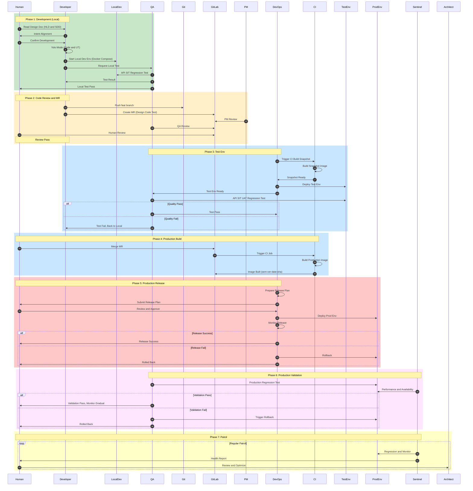

# AI-Native Development Guide Book

**版本**: v0.2.0-alpha
**对齐项目版本**: ≥ v2.4（见文末「与项目 CHANGELOG 的同步关系」）
**更新日期**: 2026-07-29
**状态**: 🚧 持续迭代中

---

## 📖 前言

本指南书籍系统阐述 AI-Native 开发方法论，核心理念是：

**AI-Native + 软件工程标准 = 可持续、高质量的工程开发**

> 本指南是 [agent-team-archetype](../../) 仓库的方法论专著——该仓库是 AI-Native **原型模板（archetype）**，采用「主项目方法论 + `examples/backend` 范例」双层结构。指南内容随仓库 [`CHANGELOG.md`](../../CHANGELOG.md) 演进持续迭代，同步机制见文末。

### 评判标准的转变

- ❌ **不是**：写更多的代码
- ✅ **而是**：开发足够可控、质量可靠的工程

### 工程成熟度特征

一个高成熟度的 AI-Native 工程应该具备：

- ✅ **换人来做** → 随时进入状态
- ✅ **隔半年再激活** → 持续迭代开发
- ✅ **设计-代码-测试** → 三域对齐一致

---

## 目录

### [Part I: 理念篇 - AI-Native 开发范式](#part-i-理念篇---ai-native-开发范式)
- [Chapter 1: AI-Native 开发概述](#chapter-1-ai-native-开发概述)
- [Chapter 2: AI-Native 项目中人类的角色](#chapter-2-ai-native-项目中人类的角色)

### [Part II: 方法篇 - 设计驱动的工程化开发](#part-ii-方法篇---设计驱动的工程化开发)
- [Chapter 3: 设计分层与渐进式披露](#chapter-3-设计分层与渐进式披露)
- [Chapter 4: 设计文档语义化版本控制](#chapter-4-设计文档语义化版本控制)
- [Chapter 5: 设计-代码-测试一致性](#chapter-5-设计-代码-测试一致性)

### [Part III: 实践篇 - AI-Native 开发工作流](#part-iii-实践篇---ai-native-开发工作流)
- [Chapter 6: 分级测试策略](#chapter-6-分级测试策略)
- [Chapter 7: AI-Native 开发流程](#chapter-7-ai-native-开发流程)
- [Chapter 8: 多 Feature 并行开发](#chapter-8多-feature-并行开发)
- [Chapter 9: 阶梯发布策略](#chapter-9-阶梯发布策略)
- [Chapter 10: 技术债务管理与持续优化](#chapter-10-技术债务管理与持续优化)

### [Part IV: 工具篇 - Agent 与技能体系](#part-iv-工具篇---agent-与技能体系)
- [Chapter 11: Agent 技能体系](#chapter-11-agent-技能体系)
- [Chapter 12: 工具链集成](#chapter-12-工具链集成)

### [Part V: 指南篇 - 实施路径](#part-v-指南篇---实施路径)
- [Chapter 13: 环境搭建与项目初始化](#chapter-13-环境搭建与项目初始化)
- [Chapter 14: 工程成熟度评估](#chapter-14-工程成熟度评估)
- [Chapter 15: 实施案例与最佳实践](#chapter-15-实施案例与最佳实践)

### [Appendix](#appendix)
- [Appendix A: 设计文档模板](#appendix-a-设计文档模板)
- [Appendix B: 测试用例模板](#appendix-b-测试用例模板)
- [Appendix C: 发布检查清单](#appendix-c-发布检查清单)
- [Appendix D: 参考资源](#appendix-d-参考资源)

---

# Part I: 理念篇 - AI-Native 开发范式

**目标**: 阐述 AI-Native 开发的核心理念和价值主张

---

## Chapter 1: AI-Native 开发概述

### 1.1 什么是 AI-Native 开发

🔧 **TODO**: 待补充

> AI-Native 开发是以 AI 协作为核心的软件开发范式，通过 AI Agent 与人类的协作，实现设计驱动、工程化标准的可持续开发。

### 1.2 传统开发 vs AI-Native 开发

🔧 **TODO**: 待补充

| 维度 | 传统开发 | AI-Native 开发 |
|------|---------|----------------|
| 开发主体 | 人类程序员 | AI Agent + 人类 |
| 关注点 | 代码实现细节 | 需求、设计、验收 |
| 质量保障 | 人工 Code Review | 自动化验证 + 三域对齐 |
| 文档维护 | 事后补充 | 设计驱动，实时同步 |

### 1.3 评判标准的转变：从代码量到工程成熟度

传统开发的评判标准往往关注代码量、开发速度等指标。AI-Native 开发的评判标准转向**工程成熟度**：

- **可控性**：设计-代码-测试三域对齐，变更可追溯
- **可靠性**：分级测试覆盖，质量门禁保障
- **可持续性**：文档完整，换人/隔半年都能快速进入状态

### 1.4 可持续性开发的核心原则

🔧 **TODO**: 待补充

1. **设计驱动**：Design 作为 SSOT (Sole Source of Truth)
2. **工程化标准**：分级测试、阶梯发布成为工程准则
3. **角色协作**：基于 Agent 角色的专业分工
4. **持续迭代**：设计文档语义化版本控制

---

## Chapter 2: AI-Native 项目中人类的角色

### 2.1 从实现细节中解放

> "在一个 AI-native 的项目里，人类也已经从复杂的代码实现细节里解脱出来了。"

传统开发中，人类程序员需要关注：
- 代码语法和实现细节
- 调试和排查 bug
- 编写重复性的代码

AI-Native 开发中，这些工作由 AI Agent 承担，人类从繁琐的实现细节中解放出来。

### 2.2 人类专注的领域：需求、设计、技术方案、验收

AI-Native 项目中，人类应该专注的领域：

- ✅ **需求理解**：深入理解业务需求和用户场景
- ✅ **架构设计**：技术选型、架构决策、接口设计
- ✅ **技术方案**：实现路径、关键技术点、风险评估
- ✅ **验收标准**：定义测试用例、质量门禁、验收场景

### 2.3 AI 的角色：执行、验证、总结

AI 在 AI-Native 开发中的角色：

- **执行**：根据设计文档生成代码、编写测试用例
- **验证**：运行测试、检查代码质量、验证设计-代码-测试一致性
- **总结**：生成报告、总结经验、提出优化建议

### 2.4 AI 编程的本质：加速设计→实现→验证的效率

> "其实 AI 编程本身只是加速了'设计→ 实现→验证'的效率，关键的一些架构决策、技术判断，主要还是靠人。"

**示例：架构决策的快速验证**

在 example-service 项目中，最初实现时没有线上运维数据，无法判断数据增速。通过回归测试的数据分析，发现 AI 推荐的 LEFT JOIN 方案存在性能问题（v4.1 版本架构缺陷）。

在 v4.2 版本中，人类做出架构决策：**将记录数更多的大表放在 LEFT JOIN 左侧**，从而减少行扫量。

**这个过程中，AI 的作用**：
- 快速实现不同的架构方案
- 执行回归测试，收集性能数据
- 总结分析结果，辅助人类决策

**结论**：AI 的执行能力和总结能力，让人类快速验证架构决策，但关键决策仍需人类智慧。

### Part I 常见问题

**Q: AI-Native 开发是否意味着人类完全不需要写代码？**
A: 不是。人类仍然需要编写关键逻辑、审查代码、做出架构决策。AI-Native 开发的核心转变是人类从"逐行实现"变为"设计意图→验证结果"——人类专注于"做什么"和"为什么"，AI 承担"怎么做"和"验证对不对"。

**Q: 如何衡量 AI-Native 项目的开发效率？**
A: 传统指标（代码行数、提交频率）不再适用。AI-Native 的关键指标是：1) 设计-实现一致性（spec-xchecker 通过率）2) 测试覆盖率（UT/API/SIT/UAT） 3) 发布成功率 4) 从 Design 到上线的周期时间 5) 返工率（意图偏差导致的重写比例）。

**Q: 人类角色"从实现者转变为设计者"具体怎么做？**
A: 实践中这意味着：1) 先写 Design Doc 再让 Agent 实现 2) 验收时对比 Design 和实际产出，而非逐行 review 代码 3) 发现问题时先更新 Design，再让 Agent 修正实现 4) 把精力放在需求澄清、架构选型和验收标准定义上。

---

# Part II: 方法篇 - 设计驱动的工程化开发

**目标**: 阐述设计驱动开发的方法论和分层设计体系

---

## Chapter 3: 设计分层与渐进式披露

### 3.1 文档分层设计体系

> "文档是需要'分层设计'的"

完整的开发验证路径应该包含：

```
系统定义 → 服务（模块）描述 → 概要设计 → 详细设计（SDD)
→ [代码实现 → 测试验证 → 交付部署]
→ 运维监控 → 功能巡检 → 需求反馈
```

**设计阶段**（代码实现之前）：
- 系统定义
- 服务描述
- 概要设计
- 详细设计（SDD）

**设计的目的**：
- 对齐意图，需要人看得懂，把关
- 更重要的是：这些设计文档是让 **AI 看的**

**文档格式建议**：使用 `.md` 格式这种半结构化文本，便于 AI 理解和处理。

### 3.2 设计文档的层级结构

🔧 **TODO**: 待补充

| 层级 | 文档类型 | 目标读者 | 内容粒度 |
|------|---------|---------|---------|
| 系统定义 | System Definition | 人类 + AI | 系统边界、核心概念 |
| 服务描述 | Service Description | 人类 + AI | 服务职责、接口定义 |
| 概要设计 | HLD (High-Level Design) | 人类为主 | 架构方案、技术选型 |
| 详细设计 | SDD (Software Design Document) | AI 为主 | 接口细节、数据模型、逻辑流程 |

### 3.3 渐进式披露（LOD）思想

> "文档分层设计隐含了渐进式披露的思想。也是考虑到当前主流编程模型的上下文窗口普遍也就 200K，分层设计文档的内容要体现 LOD (Level of Details)。"

**渐进式披露（Level of Details, LOD）**：

- **高层设计**：提供全局视图，关键决策点
- **中层设计**：展开关键模块的详细方案
- **低层设计**：提供实现细节，供 AI 代码生成

**好处**：
- 符合人类认知规律（从全局到局部）
- 适配 AI 上下文窗口限制（按需加载细节）
- 便于文档维护和版本控制

### 3.4 设计文档作为 AI 的上下文输入

在 AI-Native 开发中，设计文档不仅是给人类看的，更是给 AI 看的：

- **半结构化文本**（Markdown）便于 AI 解析
- **分层设计**符合 AI 上下文窗口限制
- **清晰的结构**帮助 AI 理解设计意图

**实践建议**：
- 使用一致的文档模板
- 使用语义化的标题层级
- 包含清晰的接口定义和数据模型

---

## Chapter 4: 设计文档语义化版本控制

### 4.1 Design Doc Semantic Versioning 的必要性

> "在 example-service 的实践里是按照 design doc semantic versioning 的方式管理的，version 粒度取决于内容变更的影响。"

**为什么需要版本控制？**

Design 文档是代码工程的 **SSOT (Sole Source of Truth)**，Design 一变，相关的代码、测试用例也跟着变了。牵一发而动全身。

**版本控制的作用**：
- 控制 **Design → Scrum → Code → Test** 的状态对齐
- 追踪设计演进的历史
- 管理变更影响范围

### 4.2 Design 作为 SSOT (Sole Source of Truth)

> "我是假设 DESIGN 是一个代码工程的 SSOT (Sole Source of Truth)，SCRUM 内容（SDD 驱动）是 DESIGN 的具体的'详细设计+行动计划+验收标准'。"

**三域关系**：

```
Design (SSOT)
  ↓ 驱动
Scrum (详细设计 + 行动计划 + 验收标准)
  ↓ 驱动
Code (代码实现)
  ↓ 验证
Test (测试用例)
```

**关键原则**：
- Design 是唯一真实来源（SSOT）
- Scrum 是 Design 的具体化（详细设计、行动计划、验收标准）
- Code 和 Test 必须与 Design 保持一致

### 4.3 版本控制 Design → Scrum → Code → Test 的对齐

> "工程化路径上，我注意到 DESIGN 这个 SSOT 本身也是在不断演进的，DESIGN 一变，相关的代码、测试用例，也跟着变了。牵一发而动全身。"

**版本控制策略**：

| Design 版本 | Scrum 版本 | Code 版本 | Test 版本 | 状态 |
|------------|-----------|-----------|-----------|------|
| v1.0 | v1.0 | v1.0 | v1.0 | ✅ 对齐 |
| v1.1 | v1.1 | v1.0 | v1.0 | ⚠️ 待更新 Code/Test |
| v1.1 | v1.1 | v1.1 | v1.0 | ⚠️ 待更新 Test |
| v1.1 | v1.1 | v1.1 | v1.1 | ✅ 对齐 |

**对齐验证**：使用四路交叉验证工具（spec-xchecker）检查 Design Spec ↔ Scrum ↔ Code ↔ Tests 的一致性。

### 4.4 版本号规则与变更影响评估

🔧 **TODO**: 待补充

**语义化版本号规则**：
- **MAJOR**（v1.0 → v2.0）：架构重大变更，影响多个模块
- **MINOR**（v1.0 → v1.1）：新增功能或模块变更，影响范围可控
- **PATCH**（v1.0.0 → v1.0.1）：bug 修复或小改进，不影响架构

**变更影响评估**：
- 评估变更影响范围（Design → Scrum → Code → Test）
- 确定版本号级别（MAJOR/MINOR/PATCH）
- 制定对齐计划和验证方案

---

## Chapter 5: 设计-代码-测试一致性

### 5.1 三域对齐的重要性

> "回归测试就是你的'设计验证器'，必须要重视你的测试用例的维护和迭代，测试用例需要跟你的设计文档保持一致，才能约束你的代码实现不会自由发挥。"

**三域对齐**：

```
Design (设计意图)
  ↓ 应该一致
Code (代码实现)
  ↓ 应该一致
Test (测试验证)
```

**为什么重要？**

- **设计缺陷**：如果 Design 本身有缺陷（如 FK 带来的隐蔽 bug），Code 和 Test 也会继承这个缺陷
- **代码自由发挥**：如果没有 Test 约束，Code 实现可能会偏离 Design
- **测试滞后**：如果 Test 没有跟随 Design 更新，无法验证新的设计意图

### 5.2 Design SSOT 驱动开发

**Design 作为 SSOT 的开发流程**：

1. **编写 Design 文档**（概要设计）
2. **从 Design 生成 Scrum**（详细设计 + 行动计划 + 验收标准）
3. **从 Scrum 生成 Code**（代码实现）
4. **从 Scrum 生成 Test**（测试用例）
5. **验证三域一致性**

**关键工具**：
- 四路交叉验证工具（spec-xchecker）
- Design ↔ Scrum ↔ Code ↔ Tests

### 5.3 SDD (OpenSpec, SuperPowers) 的作用

> "用 SDD (OpenSpec, SuperPowers) 也是为了实现工程化开发去生成可控、可解释、质量有保障的代码。"

**SDD (Software Design Document)**：
- **OpenSpec**：开放的规范格式，便于 AI 理解
- **SuperPowers**：增强的描述能力，支持复杂场景描述

**SDD 的作用**：
- 桥接 Design 和 Code
- 提供详细的实现指导
- 定义验收标准和测试用例

### 5.4 四路交叉验证工具：Design Spec ↔ Scrum ↔ Code ↔ Tests

🔧 **TODO**: 待补充

**四路交叉验证（spec-xchecker）**：

检查以下四个领域的一致性：
1. **Design Spec**：概要设计文档
2. **Scrum**：详细设计（SDD）+ 行动计划 + 验收标准
3. **Code**：代码实现
4. **Tests**：测试用例

**验证维度**：
- 接口一致性：Design 定义的接口是否在 Code 和 Test 中体现
- 逻辑一致性：业务逻辑是否在 Code 和 Test 中正确实现
- 数据一致性：数据模型是否在 Code 和 Test 中正确使用
- 验收一致性：验收标准是否在 Test 中覆盖

### Part II 常见问题

**Q: Design 文档和 Code 注释有什么区别？**
A: Design 文档是 SSOT（唯一真实来源），定义"系统应该是什么样"；Code 注释解释"这段代码做了什么"。Design 驱动 Code，Code 实现 Design。Design 变更时，Code 必须跟进；反之不然。Design 面向人类和 AI 的理解，Code 注释面向维护者。

**Q: 语义化版本控制只适用于 Design 文档吗？**
A: 核心是 Design 文档版本化，但版本号会传导到 Scrum（Story 引用 Design 版本）、Code（注释标注 Design 版本）和 Test（测试用例关联 Design 版本）。四路版本对齐是三域一致性的基础——参见 Chapter 4.3 的版本传导机制。

**Q: spec-xchecker 发现不一致时如何修复？**
A: 修复顺序遵循 SSOT 原则：以 Design 为准，1) 先确认 Design 是否需要更新（如果 Design 本身有误，更新 Design）2) 再同步 Code 和 Test 3) 最后更新 Scrum（Story 的验收标准）。修复后重新运行 spec-xchecker 验证。

---

# Part III: 实践篇 - AI-Native 开发工作流

**目标**: 阐述具体的开发流程、测试策略和发布策略

---

## Chapter 6: 分级测试策略

### 6.1 完整开发验证路径

> "工程实践经验，分级测试、阶梯发布，可以成为一个工程准则。"

**完整开发验证路径**：

```
UT (单元测试, 50%+)
  ↓
API (契约测试, 100%)
  ↓
SIT (系统集成测试, 90%+)
  ↓
E2E (端到端联调, 数据层+后端+前端三层贯通)
  ↓
UAT (用户验收测试, 85%+)
```

**工程准则**：
- 分级测试：每一级测试都有明确的目标和覆盖要求
- 阶梯发布：本地 → 测试环境 → 生产环境
- 质量门禁：每一级测试通过后才能进入下一级

### 6.2 测试分层对应

| 测试层级 | 测试目标 | 测试范围 | 依赖方式 | 覆盖率目标 |
|---------|---------|---------|---------|-----------|
| **UT** (单元测试) | 函数级别逻辑正确性 | 单个函数/方法 | Mock 外部依赖 | ≥ 50% |
| **API** (契约测试) | 接口契约符合性 | HTTP 接口 | 真实 HTTP 请求/响应 | 100% |
| **SIT** (系统集成测试) | 数据层 × 服务层一致性（交叉验证定位服务层 bug） | 跨模块业务流程 | 真实数据库 + Redis | ≥ 90% |
| **E2E** (端到端联调) | 数据层 + 后端 + 前端三层贯通 | 前端 UI 触发的完整链路 | 完整部署环境（Playwright） | — |
| **UAT** (用户验收测试) | 用户场景满足度 | 端到端用户场景 | 端到端环境 | ≥ 85% |

### 6.3 覆盖率目标与质量门禁

**覆盖率目标**：
- UT ≥ 50%
- API = 100%
- SIT ≥ 90%
- UAT ≥ 85%

**质量门禁**：
- 每一级测试通过后才能进入下一级
- 覆盖率不达标不允许发布
- 关键路径必须有测试覆盖

### 6.4 UT vs SIT 的本质区别

> "解释了为什么 UT 无法取代 SIT，DAO 层本质是'服务层-数据层'的接口，你需要脚手架能够快速搭建一个'集成环境'来执行 SIT（服务、数据、中间件）。"

**UT（单元测试）**：
- 测试范围：单个函数/方法
- 依赖方式：Mock 外部依赖
- 适用场景：算法逻辑、数据处理、工具函数

**SIT（系统集成测试）**：
- 测试范围：跨模块业务流程
- 依赖方式：真实数据库 + Redis + 消息队列
- 适用场景：业务流程、数据流转、系统集成

**为什么 UT 无法取代 SIT？**

- DAO 层是"服务层-数据层"的接口
- UT 只能 Mock 数据层，无法验证真实的数据交互
- SIT 需要搭建完整的集成环境（服务、数据、中间件）

**SIT 的交叉验证价值（DB-direct × API 对比）**

SIT 不仅验证"业务流程正确性"，更承担**定位服务层 bug** 的职责——同一份预期数据，分别用 **DB 直查** 与 **API 调用** 两条路径取回并对比：

| 对比结果 | 定位结论 |
|---------|---------|
| ✅ DB 直查 == API 返回 | 数据层与服务层一致，无服务层 bug |
| ⚠️ DB 直查正确，API 返回错 | **服务层 bug**（数据对了，但接口取错/算错） |
| 🔴 DB 直查错，API 返回"对" | **数据层 bug**（数据本就脏，接口只是如实返回） |
| 🔴 两者都错 | 查根因：数据写入错 or 服务读取错，需进一步分层 |

> 这套"双路对比"是 SIT 区别于 E2E 的核心价值：E2E 只看端到端结果对不对，**定位不出 bug 在哪一层**；SIT 的 DB-direct 交叉验证能精确指向服务层或数据层。详见 qa skill [`testing_layer_definitions.md`](../../.claude/skills/qa/references/testing_layer_definitions.md)。

---

## Chapter 7: AI-Native 开发流程

### 协作流程图

```mermaid
graph TB
    Start([Project Start]) --> Human[Human]

    %% Design Phase
    Human --> |Requirements| Architect[Architect]
    Architect --> |HLD| ProjectManager[ProjectManager]
    ProjectManager --> |SDD| DesignDone{Design Done}

    %% Development Phase
    DesignDone --> Developer[Developer]
    Developer --> |Align| Align[Human Confirm]
    Align --> |Confirm| YOLO[YOLO Mode]
    YOLO --> |Code UT| LocalDev[Local Dev Env]
    LocalDev --> |Docker Compose| LocalQA[QA]
    LocalQA --> |API SIT Test| LocalTest{Local Test Pass}
    LocalTest --> |No| YOLO
    LocalTest --> |Yes| PushMR[Push MR]

    %% Code Review Phase (PM + QA + Human)
    PushMR --> Review[Code Review]
    Review --> |PM Review| RevPM[PM]
    Review --> |QA Review| RevQA[QA]
    Review --> |Human Review| RevHuman[Human]
    RevPM --> ReviewPass{Review Pass}
    RevQA --> ReviewPass
    RevHuman --> ReviewPass
    ReviewPass --> |Yes| DevOps[DevOps]
    ReviewPass --> |No| Developer

    %% Test Env (DevOps -> CI Build Snapshot -> Deploy Test Env -> QA Test)
    DevOps --> CIBuild[CI Build Snapshot]
    CIBuild --> |Snapshot Image| DeployTest[Deploy Test Env]
    DeployTest --> QATest[QA Regression Test]
    QATest --> |API SIT UAT| TestQuality{Quality Pass}
    TestQuality --> |No| Developer
    TestQuality --> |Yes| MRMerge[MR Merge]

    %% Production Build
    MRMerge --> CIProd[CI Build Production]
    CIProd --> |Production Image| PreparePlan[Prepare Release Plan]

    %% Production Release (Release Plan -> Human Review -> Deploy Prod Env)
    PreparePlan --> HumanReview[Human Review]
    HumanReview --> |Approve| DeployProd[Deploy Prod Env]
    HumanReview --> |Reject| PreparePlan
    DeployProd --> Monitor{Deploy Success}
    Monitor --> |No| Rollback[Rollback]
    Monitor --> |Yes| ProdValid[Prod Validation]

    %% Production Validation Phase
    ProdValid --> QASentinel[QA Sentinel]
    QASentinel --> |Regression Test| Validation{Validation Pass}
    Validation --> |No| Rollback
    Validation --> |Yes| Stable[Stable]

    %% Continuous Patrol Phase
    Stable --> Sentinel[Sentinel]
    Sentinel --> |Patrol| HealthReport[Health Report]
    HealthReport --> Human
    Human --> |Optimize| Architect

    style Architect fill:#e1f5ff
    style ProjectManager fill:#fff3e0
    style Developer fill:#e8f5e9
    style DevOps fill:#f3e5f5
    style Sentinel fill:#fff9c4
    style Human fill:#ffccbc

    classDef agentRole fill:#e1f5ff,#fff3e0,#e8f5e9,#fce4ec,#f3e5f5,#fff9c4
    class Architect,ProjectManager,Developer,DevOps,Sentinel agentRole
```



### 时序图（Sequence Diagram）

以下时序图展示 AI-Native 开发的完整角色交互过程，包含 7 个主要阶段。



**时序图说明**：
- **Phase 1 (Development)**: Local development and validation, including intent alignment, Yolo Mode, Local Dev Env testing
- **Phase 2 (Code Review and MR)**: Create MR, PM and QA and Human review code
- **Phase 3 (Test Env)**: DevOps triggers CI Build Snapshot, Deploy Test Env, run full regression tests, quality gate check
- **Phase 4 (Production Build)**: Build production image after MR merge
- **Phase 5 (Production Release)**: DevOps prepares Release Plan, Human Review, Deploy Prod Env, including rollback mechanism
- **Phase 6 (Production Validation)**: Production regression test and gradual rollout observation
- **Phase 7 (Patrol)**: Sentinel regular patrol and health report

---

### 7.1 Agent 协作开发模式

> "在本地开发代码的环境中，code review 也可以继续委托给 /arch /pm '批判反馈'，基本都是基于'角色'去驱动软件开发。"

**基于角色的开发模式**：

- **/arch**：架构设计、技术选型、设计文档语义化版本管理、跨层一致性审查
- **/pm**：项目管理，Story/Epic/Sprint 编排、AC 驱动的任务拆解、看板与状态机门禁
- **/dev**：代码实现、单元测试、本地自测、无-story 重构场景
- **/qa**：测试验证策略（UT/API/SIT/E2E/UAT）、`@trace` 可追溯性、设计漂移检测、分层用例 review
- **/ued**：前端体验设计、组件开发、交互优化、原型生成
- **/devops**：发布运维、环境搭建、Docker/Helm 模板、监控告警
- **/commit**：代码提交规范、Conventional Commits、MR 描述与作用域
- **/refactor**：安全重构（逻辑不变前提下的结构优化、坏味道识别）
- **/sentinel**：线上巡检、健康检查、RCA、数据质量验证
- **/spec-xchecker**：Design↔Scrum↔Code↔Tests 四路对齐检查（与 /qa 的 `@trace` review 互补）

**协作模式**：
1. /arch 设计架构、接口与数据模型
2. /pm 从设计拆解 Story/Epic、排期并维护状态门禁
3. /dev 按 SDD 实现代码与单元测试
4. /qa 制定测试策略、用 `@trace` 标注追溯信息、执行分层测试
5. /ued 前端体验与组件（如涉及）
6. /devops 准备环境与发布计划
7. /refactor 安全重构（技术债治理时）
8. /commit 规范化提交与 MR
9. /sentinel 线上巡检
10. /spec-xchecker 四路对齐检查（贯穿全程）

### 7.2 Agent Team 技能体系（10 角色）

**角色定义**：

| 角色 | 职责 | 技能 | 输出 |
|------|------|------|------|
| Architect | 架构设计、技术选型、版本管理 | /arch | Design Doc (HLD/SDD) |
| Project Manager | Story/Epic 编排、AC 拆解、状态门禁 | /pm | SDD + 行动计划 + 看板 |
| Developer | 代码实现、单元测试 | /dev | Code + UT |
| QA | 测试策略、可追溯性、漂移检测 | /qa | Test Plan + Test Report |
| UED | 前端体验、组件、原型 | /ued | 原型 + 组件 |
| DevOps | 发布运维、监控告警 | /devops | Deployment Plan |
| Committer | 提交规范、MR 描述 | /commit | Commit + MR |
| Refactorer | 安全重构、坏味道治理 | /refactor | 重构报告 |
| Sentinel | 线上巡检、RCA | /sentinel | 巡检报告 |
| Spec-XChecker | Design↔Scrum↔Code↔Tests 对齐检查 | /spec-xchecker | 对齐报告 |

> **pm 是流程编排中枢**：Story 状态机（8 状态 FSM）以 **AC 签字率** 作为门禁——IN_PROGRESS 需 [UT]、TESTING 需 [SIT] 等；`@trace` 是 review 工具，**不影响** pm 的状态门禁（门禁按 AC 签字率，不按 `@trace` 覆盖率）。详见 §6 测试策略与 qa skill [`test_traceability.md`](../../.claude/skills/qa/references/test_traceability.md)。

### 7.3 开发流程详解

> "进入具体的 worktree 开 claude code，直接问 /dev 它的开发计划，确认无误之后，就可以去 yolo 开发了，直到完成所有'本地开发'的联调验证。"

**Step 1: Worktree 准备**

```bash
# 为每个 feature 创建独立的 worktree
git worktree add ../project-feature-a feature-a
git worktree add ../project-feature-b feature-b
git worktree add ../project-feature-c feature-c
```

**Step 2: 启动 Agent Session**

为每个 worktree 启动独立的 Claude Code session，可以并行开发。

**Step 3: 意图对齐与理解确认**

> "还是这个 session，/dev 在获取了相关文档（架构设计、详细设计，场景描述，验收标准）后，会给你讲一讲它的理解。这一步非常重要，这不光对齐意图，也是人类在矫正 agent 的 context 初始内容、方向、步骤、标准。你不给 CC 说清楚，你的 agent 大概率会在 yolo mode 下放飞自我。"

Agent 会：
1. 读取相关文档（架构设计、详细设计、场景描述、验收标准）
2. 总结它的理解
3. 提出澄清问题

人类需要：
1. 确认 Agent 的理解是否正确
2. 矫正 Agent 的 context 初始内容
3. 明确方向、步骤、标准

**Step 4: 开发计划确认**

> "story-15-25 的执行计划详情，确认无误后，让 /dev 在 yolo mode 下做本地开发自测。"

Agent 会生成详细的开发计划，包括：
- 任务拆解
- 实现步骤
- 验证方法

人类确认无误后，允许 Agent 进入 YOLO mode。

**Step 5: YOLO Mode 开发与自测**

Agent 在 YOLO mode 下：
- 自动执行开发计划
- 生成代码和测试
- 运行本地验证
- 完成后主动通知人类

### 7.4 Code Review 的 AI-Native 实践

> "code review 也可以继续委托给 /arch /pm '批判反馈'，基本都是基于'角色'去驱动软件开发。"

**AI-Native Code Review 流程**：

1. **Developer 提交 MR**（包含 Design + Code + Test）
2. **Architect 审查**：
   - 架构设计是否合理
   - 接口定义是否符合 Design
   - 技术选型是否恰当
3. **PM 审查**：
   - 任务完成度是否符合 SDD
   - 验收标准是否满足
   - 测试覆盖是否充分
4. **QA 审查**：
   - 测试用例是否完整
   - 测试覆盖率是否达标
   - 测试质量是否合格

**MR 要求**：

> "提供一个包含'设计、代码、测试'三者俱全的 MR 例子：https://git.example.com/example-org/example-service/-/merge_requests/41/diffs"

> "一般我会再 MR 里确保三个领域（design/code/test）的内容是可以相互佐证的才会提交。"

MR 必须包含：
- **Design**：设计文档或设计变更说明
- **Code**：代码实现
- **Test**：测试用例和测试结果

**三域相互佐证**：
- Design ↔ Code：代码实现是否符合设计意图
- Design ↔ Test：测试用例是否覆盖设计要点
- Code ↔ Test：测试是否验证代码逻辑

### 7.5 设计域的 Agent（/arch /pm）

> "在'设计域'，我目前设置的 /arch /pm 这两个 agent，是天然对接代码工程级的'概要设计（design）'和'详细设计（scrum）'的。"

> "我已经训练了 pm 从概要设计里读取设计内容、拆解任务、分类排期这些能力。"

**/arch 的能力**：
- 从需求生成概要设计
- 技术选型和架构决策
- 设计文档审查和优化

**/pm 的能力**：
- 从概要设计生成详细设计（SDD）
- 任务拆解和排期规划
- 验收标准定义

---

## Chapter 8: 多 Feature 并行开发

### 8.1 Worktree 的使用

> "本地开发如何多 feature 并行开发？使用 worktree，图中是我同时开了 3 个可独立开发（互不影响）的 worktree，接下来就可以分 3 个 CC session，独立开发，独立提 MR，独立发布测试环境验证。"

**什么是 Worktree？**

Git worktree 允许你在同一个仓库中检出多个分支到不同的目录，实现并行开发。

**创建 Worktree**：

```bash
# 为 feature-a 创建 worktree
git worktree add ../project-feature-a feature-a

# 为 feature-b 创建 worktree
git worktree add ../project-feature-b feature-b

# 为 feature-c 创建 worktree
git worktree add ../project-feature-c feature-c
```

**好处**：
- 每个 feature 独立开发，互不影响
- 可以快速切换上下文
- 支持并行开发多个 feature

### 8.2 多 Claude Code Session 并行

**并行开发流程**：

```bash
# Terminal 1: Feature A
cd ../project-feature-a
claude
# 启动 /dev 开发 feature-a

# Terminal 2: Feature B
cd ../project-feature-b
claude
# 启动 /dev 开发 feature-b

# Terminal 3: Feature C
cd ../project-feature-c
claude
# 启动 /dev 开发 feature-c
```

**如此模式，可以一次启动 4 个**（或更多）并行 session。

### 8.3 独立开发、独立测试、独立发布

每个 worktree/session 都是独立的：
- **独立开发**：互不干扰，各自实现
- **独立测试**：各自运行测试，验证功能
- **独立发布**：各自提 MR，独立发布到测试环境验证

### 8.4 并行开发的协作规范

🔧 **TODO**: 待补充

**协作规范**：
1. **依赖管理**：明确 feature 之间的依赖关系
2. **接口约定**：提前定义接口，避免冲突
3. **集成策略**：定义集成顺序和验证方法
4. **冲突解决**：定期合并主分支，解决冲突

---

## Chapter 9: 阶梯发布策略

### 9.1 阶梯发布路径

> "阶梯发布策略: 本地自测（docker-compose） -> 功能提测（helm 发布测试环境） -> 生产发布（helm 发布生产环境）"

**阶梯发布路径**：

```
本地自测 (docker-compose)
  ↓ 验证通过
功能提测 (helm 发布测试环境)
  ↓ 验证通过
生产发布 (helm 发布生产环境)
```

**每一级的目的**：
- **本地自测**：验证基本功能和逻辑
- **功能提测**：在类生产环境中验证功能
- **生产发布**：灰度发布，监控验证

### 9.2 发布计划要素

> "用 /devops 这个负责发布的 agent skill 去实现，发布前需要提供发布计划（变更清单：服务、配置、数据）/回滚方案/灰度方案。"

**发布计划必须包含**：

1. **变更清单**：
   - 服务变更：哪些服务发生变化
   - 配置变更：哪些配置发生变化
   - 数据变更：哪些数据结构发生变化

2. **回滚方案**：
   - 回滚步骤：如何快速回滚到上一版本
   - 数据回滚：如何处理数据变更
   - 配置回滚：如何恢复配置

3. **灰度方案**：
   - 灰度策略：按流量、按用户、按地区
   - 灰度验证：如何验证灰度效果
   - 灰度回滚：何时触发回滚

### 9.3 发布前的验证检查点

🔧 **TODO**: 待补充

**发布前检查清单**：

- [ ] UT 测试通过（覆盖率 ≥ 50%）
- [ ] API 契约测试通过（100%）
- [ ] SIT 测试通过（覆盖率 ≥ 90%）
- [ ] UAT 验收通过（覆盖率 ≥ 85%）
- [ ] Design ↔ Code ↔ Test 一致性验证通过
- [ ] 性能测试通过
- [ ] 安全扫描通过
- [ ] 发布计划完整（变更清单、回滚方案、灰度方案）
- [ ] 监控告警配置完成

---

## Chapter 10: 技术债务管理与持续优化

### 10.1 回归测试作为设计验证器

> "因为涉及架构方案调整，上述巡检里的某些用例就体现了'设计意图-代码实现、数据库配置'（设计缺陷，FK 带来了更隐蔽的 bug）之间的 mismatch。"

> "回归测试就是你的'设计验证器'，必须要重视你的测试用例的维护和迭代，测试用例需要跟你的设计文档保持一致，才能约束你的代码实现不会自由发挥。"

**回归测试的作用**：
- 验证设计意图是否被正确实现
- 发现设计与实现之间的 mismatch
- 发现代码实现中的 bug 和缺陷
- 验证架构变更的影响范围

### 10.2 通过数据分析发现架构缺陷

> "在最初一版实现的时候，因为没有线上运维数据，没法判断数据增速；只有在运维一段时间之后，通过回归测试的数据分析，就会发现最初的 AI 推荐的方案存在性能问题。"

**案例：LEFT JOIN 性能问题**

- **v4.1 版本**：AI 推荐的 LEFT JOIN 方案（小表在前）
- **运维一段时间后**：通过回归测试数据分析，发现性能问题
- **根因分析**：记录数多的大表放在 RIGHT，导致行扫量过大
- **v4.2 版本**：架构调整，将大表放在 LEFT JOIN 左侧，减少行扫量

**关键点**：
- 回归测试不仅是功能验证，更是性能分析
- 通过数据分析发现架构缺陷
- 持续优化架构设计

### 10.3 架构决策的快速验证与迭代

> "这时候再去看 v4.1 版本的设计方案，存在架构缺陷。在 v4.2 这一版我就会要求把记录数更多的大表放在 LEFT JOIN 左侧，从而减少行扫量。"

> "这个过程中，AI 的执行能力和总结能力，可以让让我快速验证架构决策。"

**快速验证流程**：

1. **提出架构假设**：大表在 LEFT 可以减少行扫量
2. **AI 快速实现**：生成 v4.2 版本的代码
3. **回归测试验证**：收集性能数据
4. **数据分析**：对比 v4.1 和 v4.2 的性能
5. **总结优化**：确认架构决策的有效性

**AI 的作用**：
- 快速实现不同的架构方案
- 执行回归测试，收集数据
- 总结分析结果，辅助决策

### 10.4 Design 版本演进与架构优化

🔧 **TODO**: 待补充

**Design 版本演进**：

| 版本 | 架构方案 | 性能 | 发现问题 | 优化方案 |
|------|---------|------|---------|---------|
| v4.0 | 初始方案 | 基准 | - | - |
| v4.1 | AI 推荐方案 | ❌ 下降 | LEFT JOIN 小表在前 | - |
| v4.2 | 优化方案 | ✅ 提升 | 大表在 LEFT JOIN 左侧 | 减少 30% 行扫量 |

**持续优化**：
- 每个版本都是架构优化的机会
- 通过数据分析发现优化点
- 快速验证架构决策
- 持续迭代优化

### Part III 常见问题

**Q: 意图对齐要花多长时间？值得吗？**
A: 意图对齐通常只需 5-10 分钟（一次对话），但能节省数小时的返工。Agent 理解偏差在 YOLO Mode 下会被放大——越晚发现，修复成本越高。建议每次开发前都做意图对齐，尤其是新 Story 或复杂逻辑时。

**Q: YOLO Mode 下 Agent 出错怎么办？**
A: YOLO Mode 不是"放任不管"：1) Agent 完成后会主动通知结果 2) 检查关键逻辑是否正确 3) 运行测试验证 4) 如果偏差较大，停止 Agent，重新意图对齐后再开发。Agent 的错误通常源于意图不清晰，而非能力不足。

**Q: 并行开发时多个 Agent 修改同一文件怎么办？**
A: 这正是 Worktree 存在的意义——每个 Worktree 是独立的工作区，Agent 在各自的 worktree 中工作，不会互相冲突。合并时通过 MR 的 rebase 机制解决冲突。设计时应尽量让 Story 之间的文件修改不重叠（参见 Chapter 8 并行开发规范）。

**Q: 阶梯发布中哪一阶段最容易出问题？**
A: 统计上看，测试环境验证（Stage 3→4）是问题高发区：配置差异、数据差异、环境依赖都可能导致测试环境通过但生产失败。建议在测试环境尽量模拟生产配置，使用相同的 Helm values 结构。

---

# Part IV: 工具篇 - Agent 与技能体系

**目标**: 阐述 AI-Native 开发的工具支持和技能体系

---

## Chapter 11: Agent 技能体系

### 11.1 Agent 的角色定义

**核心 Agent 角色**（10 个技能）：

| Agent | 角色定位 | 主要职责 | 关键技能 |
|-------|---------|---------|---------|
| /arch | 架构师 | 架构设计、技术选型、版本管理 | 设计文档生成、架构审查 |
| /pm | 项目经理（PM） | Story/Epic 编排、AC 拆解、状态门禁 | SDD 生成、任务拆解、看板 |
| /dev | 开发工程师 | 代码实现、单元测试 | 代码生成、测试编写 |
| /qa | 质量工程师 | 测试策略、可追溯性、漂移检测 | `@trace` 标注、分层用例 review |
| /ued | 前端体验设计师 | 前端体验、组件、原型 | 原型生成、交互优化 |
| /devops | 运维工程师 | 发布运维、监控告警 | 发布计划、Docker/Helm |
| /commit | 提交者 | 提交规范、MR | Conventional Commits |
| /refactor | 重构者 | 安全重构 | 坏味道识别、重构技法 |
| /sentinel | 哨兵 | 线上巡检 | 健康检查、RCA |
| /spec-xchecker | 对齐检查器 | 四路对齐检查 | Design↔Scrum↔Code↔Tests |

### 11.2 Agent 协作模式

**协作模式示例**：

1. **需求阶段**：
   - 产品经理提供需求
   - /arch 生成概要设计

2. **设计阶段**：
   - /pm 从概要设计生成 SDD
   - /arch 审查 SDD

3. **开发阶段**：
   - /dev 从 SDD 生成代码和测试
   - /qa 审查测试用例

4. **测试阶段**：
   - /qa 执行测试，生成测试报告
   - /dev 修复 bug

5. **发布阶段**：
   - /devops 生成发布计划
   - /devops 执行发布和监控

### 11.3 Agent 的训练与能力建设

> "我已经训练了 pm 从概要设计里读取设计内容、拆解任务、分类排期这些能力。"

🔧 **TODO**: 待补充

**Agent 训练方法**：
- 提供示例文档和模板
- 定义清晰的技能规范
- 持续反馈和优化

**能力建设**：
- 文档理解能力：读取设计文档
- 任务拆解能力：拆解复杂任务
- 排期规划能力：合理评估工作量
- 质量保障能力：验证输出质量

---

## Chapter 12: 工具链集成

### 12.1 GitLab CI/CD 集成

🔧 **TODO**: 待补充

**CI/CD 流程**：

1. **代码提交**：触发 CI pipeline
2. **自动化测试**：运行 UT、API、SIT 测试
3. **代码质量检查**：静态分析、安全扫描
4. **构建镜像**：Docker build
5. **部署到测试环境**：Helm upgrade
6. **UAT 验证**：人工验收
7. **部署到生产环境**：Helm upgrade + 灰度

### 12.2 Docker Compose 本地环境

🔧 **TODO**: 待补充

**本地开发环境**：

```yaml
# docker-compose.yml
services:
  app:
    build: .
    ports:
      - "8080:8080"
  db:
    image: postgres:14
    environment:
      POSTGRES_DB: testdb
  redis:
    image: redis:7
```

**用途**：
- 本地自测
- SIT 测试环境
- 快速迭代验证

### 12.3 Helm Charts 发布

🔧 **TODO**: 待补充

**Helm 发布流程**：

```bash
# 发布到测试环境
./deploy/scripts/helm-upgrade.sh test snapshot-mr-30

# 发布到生产环境
./deploy/scripts/helm-upgrade.sh prod V0.1-20260428153000-a1b2c3d
```

**配置管理**：
- values-test.yaml：测试环境配置
- values-prod.yaml：生产环境配置

### 12.4 四路交叉验证工具（spec-xchecker）

🔧 **TODO**: 待补充

**spec-xchecker 技能**：
- 检查 Design Spec ↔ Scrum 一致性
- 检查 Scrum ↔ Code 一致性
- 检查 Code ↔ Tests 一致性
- 生成验证报告

**使用示例**：

```bash
# 运行四路交叉验证
/spec-xchecker
```

### Part IV 常见问题

**Q: 如何自定义 Agent Skill？**
A: 在 `.claude/skills/` 下创建目录，编写 `SKILL.md`（必需，定义触发条件和指令），可选添加 `scripts/`（可执行脚本）、`references/`（参考文档）、`templates/`（模板）。SKILL.md 的 `description` 字段决定触发时机，建议写得宽泛一些避免漏触发。完整规范参考 `.claude/skills/` 下现有 Skill 的结构。

**Q: Skill 的触发机制是什么？**
A: Skill 通过两种方式触发：1) 用户输入 `/skill名`（如 `/dev`、`/qa`）直接触发 2) Agent 根据用户自然语言中的关键词匹配 SKILL.md 的 `description` 字段自动触发。如果 Skill 未被触发，通常是 description 覆盖的场景不够——可以补充关键词或换一种说法。

**Q: 新项目如何快速配置 Agent Team？**
A: 复制本项目（agent-team-archetype）作为模板：1) 保留 `.claude/skills/` 目录结构 2) 修改各 Skill 中与业务相关的模板和配置 3) 在 `.env.skill` 中配置项目凭证 4) 根据项目技术栈调整 `scripts/` 中的脚本。详见 Chapter 13.3 项目模板创建。

---

# Part V: 指南篇 - 实施路径

**目标**: 提供从零开始的实施指南

---

## Chapter 13: 环境搭建与项目初始化

### 13.1 AI-Native 开发环境准备

🔧 **TODO**: 待补充

**环境准备清单**：
- [ ] 安装 Claude Code CLI
- [ ] 配置 Agent 技能（/arch, /pm, /dev, /qa, /devops）
- [ ] 配置 Git worktree 支持
- [ ] 配置 Docker Compose 本地环境
- [ ] 配置 Helm Charts 发布环境
- [ ] 配置 CI/CD pipeline

### 13.2 Agent 技能定义与配置

🔧 **TODO**: 待补充

**技能定义规范**：
- 技能描述
- 输入参数
- 输出格式
- 使用示例

**配置位置**：
- `~/.claude/skills/` 目录
- 每个技能一个独立目录

### 13.3 项目模板创建

🔧 **TODO**: 待补充

**项目模板结构**：

```
project-template/
├── docs/
│   ├── design/          # 设计文档
│   └── scrum/           # Scrum 文档
├── internal/
│   ├── handler/         # HTTP handlers
│   ├── logic/           # Business logic
│   ├── dao/             # Data access interfaces
│   └── model/           # Data models
├── tests/
│   ├── api/             # API tests
│   ├── sit/             # SIT tests
│   └── uat/             # UAT tests
├── deploy/
│   ├── docker/          # Docker Compose
│   └── k8s/             # Helm Charts
└── CLAUDE.md            # Project instructions
```

### 13.4 团队协作规范建立

🔧 **TODO**: 待补充

**协作规范**：
- 分支策略：Git flow / GitHub flow
- Code Review 规范：MR 必须包含 Design + Code + Test
- 发布流程：阶梯发布策略
- 文档规范：设计文档模板和版本控制

---

## Chapter 14: 工程成熟度评估

### 14.1 工程成熟度评估维度

**评估维度**：

1. **文档完整性**：
   - 设计文档是否完整
   - SDD 是否详细
   - 文档版本是否对齐

2. **测试覆盖率**：
   - UT ≥ 50%
   - API = 100%
   - SIT ≥ 90%
   - UAT ≥ 85%

3. **设计-代码-测试一致性**：
   - Design ↔ Scrum 一致性
   - Scrum ↔ Code 一致性
   - Code ↔ Tests 一致性

4. **持续交付能力**：
   - CI/CD 自动化程度
   - 发布成功率
   - 回滚速度

### 14.2 评估指标与检查清单

🔧 **TODO**: 待补充

**工程成熟度检查清单**：

- [ ] 设计文档完整（系统定义、概要设计、详细设计）
- [ ] 设计文档语义化版本控制
- [ ] 分级测试策略实施
- [ ] 三域一致性验证通过
- [ ] 阶梯发布策略实施
- [ ] Agent 技能体系完整
- [ ] CI/CD 自动化
- [ ] 监控告警完善

### 14.3 成熟度分级与改进路径

🔧 **TODO**: 待补充

**成熟度分级**：

| 等级 | 描述 | 特征 |
|------|------|------|
| Level 1: 初始级 | 无工程化标准 | 依赖个人能力，不可复制 |
| Level 2: 可重复级 | 有基本流程 | 有设计文档和测试，但不够规范 |
| Level 3: 已定义级 | 工程化标准 | 分级测试、三域对齐、版本控制 |
| Level 4: 可管理级 | 可量化管理 | 工程成熟度评估、持续优化 |
| Level 5: 优化级 | 持续优化 | 自动化、智能化、自适应 |

**改进路径**：
- Level 1 → Level 2：建立基本流程和文档规范
- Level 2 → Level 3：引入工程化标准和 Agent 技能
- Level 3 → Level 4：建立评估体系和持续优化机制
- Level 4 → Level 5：自动化和智能化

---

## Chapter 15: 实施案例与最佳实践

### 15.1 仓库结构：archetype 双层模板

> 本仓库（agent-team-archetype）本身就是一个 **AI-Native 原型模板**，可直接复制作为新项目脚手架。它采用「**主项目方法论 + `examples/backend` 范例**」双层结构——方法论与业务实现物理隔离，使主项目保持纯净、可复用。

| 层 | 位置 | 内容 | 可直接复用 |
|----|------|------|-----------|
| **主项目（方法论）** | `/`（根目录） | 方法论专著（本指南）、`GUIDE.md`/`AGENTS.md`/`CLAUDE.md`、agent skills（`.claude/skills/` + `.codex/skills/`，10 角色）、`CHANGELOG.md` | ✅ 直接复制，不含业务实现 |
| **后端范例** | `examples/backend/` | 独立 Go module（`example-service`，go-zero + GORM + PostgreSQL），完整分层架构（Handler→Logic→DAO→Model）、DAO 接口抽象、配置/部署模板、5 层测试骨架 | 📋 作为范例参考，按需具体化 |

**默认判断（重要）**：
- 业务代码改动**一律在 `examples/backend/` 内**进行；主项目根目录不新增业务实现。
- 除非明确要求，**不要把仓库补全成具体业务系统**——优先保持"模板/原型"属性。
- 复制为新项目时：保留 `.claude/skills/` 结构 → 替换业务相关模板/配置 → 在 `examples/backend/` 落地真实实现。

> `examples/backend/` 中的设计文档（`docs/design/`）、Scrum 工件（`docs/scrum/`）与测试（`tests/`，含 `@trace` 标注实例化）是方法论的**一次实例化样本**，不是方法论源头；方法论源头在主项目 skills 与本指南。

### 15.2 成功经验总结

🔧 **TODO**: 待补充

**成功因素**：
1. **设计驱动**：Design 作为 SSOT，驱动整个开发流程
2. **分级测试**：UT → API → SIT → UAT，质量保障
3. **Agent 协作**：基于角色的专业分工
4. **阶梯发布**：本地 → 测试 → 生产，降低风险
5. **持续优化**：通过回归测试发现和优化架构

### 15.3 常见陷阱与解决方案

以下陷阱基于 AI-Native 开发实践总结，每条包含症状、根因分析和具体解决步骤。

#### 陷阱 1: Design 文档不完整

**症状**：Agent 生成的代码偏离预期，频繁返工；不同 Agent 对同一功能理解不一致。

**根因**：Design 文档缺少关键信息（数据模型、接口定义、业务规则），Agent 只能"猜测"意图。

**解决步骤**：
1. 建立 Design 文档模板（参考 Appendix A），至少包含：数据模型、API 接口、核心业务逻辑、非功能需求
2. 开发前强制检查 Design 文档完整性——作为 `/dev` 的前置条件
3. 使用 `/arch` skill 生成 Design 初稿，人类审查补充后作为 SSOT
4. Design 版本化，每次变更记录变更原因和影响范围

#### 陷阱 2: Test 滞后于 Code

**症状**：代码写完后测试覆盖率低，补测试变成形式主义；回归测试发现问题时已积累大量代码变更。

**根因**：将测试视为"验证步骤"而非"设计验证器"，没有利用测试来固化 Design 的意图。

**解决步骤**：
1. 采用分级测试策略（Chapter 6）：UT 随代码写，API 测试随接口写，SIT/UAT 在本地验证通过后再提测
2. 在 Story 验收标准中用 `[UT]`/`[API]`/`[SIT]` 标签明确测试要求（参见 PM Skill 的 AC 测试分层策略）
3. 使用 `/qa` skill 基于验收标准自动生成测试计划
4. 本地验证门禁：`make test` + `pytest tests/api/` 全部通过后才推送代码

#### 陷阱 3: 三域不一致

**症状**：Design 描述的接口和代码实现不匹配；测试用例覆盖的是旧版逻辑；MR 审查时发现 Design-Code-Test 对不上。

**根因**：Design 更新后没有同步更新 Code 和 Test，或者 Code 改了但 Design 没跟上。缺乏自动化的跨域验证机制。

**解决步骤**：
1. 每次提交前运行 `/spec-xchecker` 进行四路交叉验证（Design ↔ Scrum ↔ Code ↔ Tests）
2. Design 版本变更时，更新 Story 中的版本引用，标记受影响的 Story 为 BLOCKED
3. MR 必须包含 Design、Code、Test 三部分，审查时检查三域对齐
4. 建立 Design 版本传导机制：Design 版本 → Story 引用 → Code 注释 → Test 关联

#### 陷阱 4: Agent 理解偏差

**症状**：Agent 生成的代码功能正确但实现路径不符合设计意图；意图对齐环节草草了事。

**根因**：人类对"意图对齐"不够重视，提供的上下文不足（只给 Story 文件路径，未指出关键约束），或者对齐后没有明确确认。

**解决步骤**：
1. 每次开发前执行意图对齐：让 Agent 读取 Design + Story，总结理解，人类确认后再进入 YOLO Mode
2. 对齐时明确指出：核心功能点、技术约束、验收标准、与其他模块的交互方式
3. 开发过程中保持监控，Agent 完成关键节点后主动通知（参见 `/dev` skill 的通知机制）
4. 如果发现偏差，立即停止，重新对齐后再继续——不要期望 Agent 自己纠正

#### 陷阱 5: Story 粒度过大

**症状**：一个 Story 跨越多周开发，测试反馈周期长，阻塞其他 Story 进度，MR 巨大难以审查。

**根因**：Story 拆解时没有遵循 INVEST 原则（尤其是 Small），把一个 Epic 当成一个 Story。

**解决步骤**：
1. 遵循 INVEST 原则拆解 Story，推荐粒度 2-5 个工作日，最大不超过 1 个 Sprint
2. 使用 `/pm` skill 拆解，PM 检查每个 Story 的独立性（Independent）和可测试性（Testable）
3. Story 之间通过文件路径和模块边界解耦，避免修改同一文件
4. 大功能拆为多个 Story，按依赖关系排序，上游 Story 先完成

#### 陷阱 6: 跳过 Code Review 直接合并

**症状**：代码合并后生产环境出问题；Design 和实现脱节；技术债务积累。

**根因**：赶进度跳过审查，或者审查只看代码风格不看 Design 对齐。

**解决步骤**：
1. MR 必须包含 Design + Code + Test 三部分，缺一不可
2. 审查时检查三个维度（参见 `/pm` skill 的代码审查指南）：
   - 架构审查：代码是否符合 Design 的架构意图
   - 任务审查：验收标准是否全部满足，Story 状态是否可流转
   - 测试审查：测试覆盖是否达标，三域是否一致
3. 使用 `/spec-xchecker` 在 MR 合并前做最终一致性验证
4. Human Review 重点关注 Design-Code 对齐，而非逐行代码审查

### 15.4 实施路线图建议

🔧 **TODO**: 待补充

**实施路线图**：

**Phase 1: 准备阶段（1-2 周）**
- 环境搭建和工具配置
- Agent 技能定义和训练
- 项目模板创建

**Phase 2: 试点阶段（2-4 周）**
- 选择一个小项目试点
- 实施设计驱动开发
- 实施分级测试策略
- 总结经验和问题

**Phase 3: 推广阶段（4-8 周）**
- 推广到更多项目
- 完善工具和流程
- 建立评估体系

**Phase 4: 优化阶段（持续）**
- 持续优化流程
- 持续优化 Agent 能力
- 持续提升工程成熟度

### Part V 常见问题

**Q: 团队从零开始实施 AI-Native 开发，第一步做什么？**
A: 先搭建环境（Claude Code CLI + Git worktree），再按 Part V 的路线图走 Phase 1：选择一个小项目试点，定义 Agent 技能（`.claude/skills/`），创建项目模板。不要一开始就全面铺开——先用一个 Sprint 跑通流程，再逐步推广。

**Q: 已有项目如何迁移到 AI-Native 开发模式？**
A: 建议增量迁移：1) 先为已有模块补充设计文档（Design Spec），建立 SSOT 2) 补充测试用例，建立质量基线 3) 配置 Agent Skills，从新 feature 开始使用 AI-Native 流程 4) 使用 `/spec-xchecker` 验证迁移后的三域一致性。

**Q: 如何评估团队的 AI-Native 工程成熟度？**
A: 参考 Chapter 14 的评估维度：设计驱动成熟度、测试分层成熟度、Agent 协作成熟度、持续优化成熟度。建议每周做一次项目审计（参见 PM Skill 的每周审计清单），用数据驱动改进。

---

# Appendix

---

## Appendix A: 设计文档模板

### A.1 概要设计模板

🔧 **TODO**: 待补充

**概要设计（HLD）模板**：

```markdown
# [Feature Name] - 概要设计

## 1. 背景与目标

### 1.1 背景
描述为什么需要这个功能

### 1.2 目标
描述这个功能要达到什么目标

## 2. 架构设计

### 2.1 系统架构图
\`\`\`
[架构图]
\`\`\`

### 2.2 技术选型
描述使用的技术栈和选型理由

## 3. 接口设计

### 3.1 API 接口
\`\`\`
[API 定义]
\`\`\`

### 3.2 数据模型
\`\`\`
[数据模型定义]
\`\`\`

## 4. 关键流程

### 4.1 业务流程图
\`\`\`
[业务流程图]
\`\`\`

### 4.2 关键逻辑
描述关键的业务逻辑

## 5. 非功能需求

### 5.1 性能要求
- QPS: ?
- 延迟: ?

### 5.2 可用性要求
- 可用性: ?

## 6. 风险与挑战

描述可能的风险和应对方案

## 7. 版本历史

| 版本 | 日期 | 变更说明 |
|------|------|---------|
| v1.0 | 2026-04-29 | 初始版本 |
```

### A.2 详细设计（SDD）模板

🔧 **TODO**: 待补充

**详细设计（SDD）模板**：

```markdown
# [Feature Name] - 详细设计（SDD）

## 1. 概要设计回顾

简要回顾概要设计的要点

## 2. 详细设计

### 2.1 模块设计
\`\`\`
[模块划分图]
\`\`\`

### 2.2 接口详细定义
\`\`\`
[接口详细定义]
\`\`\`

### 2.3 数据模型详细定义
\`\`\`
[数据模型详细定义]
\`\`\`

### 2.4 逻辑流程详细设计
\`\`\`
[逻辑流程图]
\`\`\`

## 3. 实现计划

### 3.1 任务拆解
\`\`\`
| 任务ID | 任务描述 | 估时 | 负责人 |
|--------|---------|------|--------|
\`\`\`

### 3.2 实现顺序
\`\`\`
[实现顺序图]
\`\`\`

## 4. 验收标准

### 4.1 功能验收
\`\`\`
| 验收项 | 验收方法 | 预期结果 |
|--------|---------|---------|
\`\`\`

### 4.2 性能验收
\`\`\`
| 性能指标 | 测试方法 | 目标值 |
|---------|---------|--------|
\`\`\`

## 5. 测试用例

### 5.1 单元测试用例
\`\`\`
[UT 用例]
\`\`\`

### 5.2 集成测试用例
\`\`\`
[SIT 用例]
\`\`\`

## 6. 版本历史

| 版本 | 日期 | 变更说明 |
|------|------|---------|
| v1.0 | 2026-04-29 | 初始版本 |
```

### A.3 API 设计模板

🔧 **TODO**: 待补充

**API 设计模板**：

```markdown
# [API Name] - API 设计

## 1. API 概述

### 1.1 API 功能描述
描述 API 的功能

### 1.2 调用场景
描述 API 的调用场景

## 2. 接口定义

### 2.1 请求定义
\`\`\`
POST /api/v1/resource
Content-Type: application/json

{
  "field1": "value1",
  "field2": "value2"
}
\`\`\`

### 2.2 响应定义
\`\`\`
{
  "code": 0,
  "message": "success",
  "data": {
    "id": "123",
    "field1": "value1"
  }
}
\`\`\`

### 2.3 错误码定义
\`\`\`
| 错误码 | 错误信息 | 说明 |
|--------|---------|------|
\`\`\`

## 3. 数据模型

\`\`\`
[数据模型定义]
\`\`\`

## 4. 业务逻辑

\`\`\`
[业务流程图]
\`\`\`

## 5. 性能要求

- QPS: ?
- 延迟: ?

## 6. 安全要求

- 认证方式: ?
- 权限控制: ?

## 7. 版本历史

| 版本 | 日期 | 变更说明 |
|------|------|---------|
| v1.0 | 2026-04-29 | 初始版本 |
```

---

## Appendix B: 测试用例模板

### B.1 UT 测试用例模板

🔧 **TODO**: 待补充

### B.2 API 契约测试模板

🔧 **TODO**: 待补充

### B.3 SIT 测试场景模板

🔧 **TODO**: 待补充

### B.4 UAT 验收场景模板

🔧 **TODO**: 待补充

---

## Appendix C: 发布检查清单

### C.1 发布前检查清单

🔧 **TODO**: 待补充

**发布前检查清单**：

- [ ] UT 测试通过（覆盖率 ≥ 50%）
- [ ] API 契约测试通过（100%）
- [ ] SIT 测试通过（覆盖率 ≥ 90%）
- [ ] UAT 验收通过（覆盖率 ≥ 85%）
- [ ] Design ↔ Code ↔ Test 一致性验证通过
- [ ] 性能测试通过
- [ ] 安全扫描通过
- [ ] 发布计划完整（变更清单、回滚方案、灰度方案）
- [ ] 监控告警配置完成

### C.2 发布后验证清单

🔧 **TODO**: 待补充

### C.3 回滚决策树

🔧 **TODO**: 待补充

---

## Appendix D: 参考资源

### D.1 推荐工具

🔧 **TODO**: 待补充

**开发工具**：
- Claude Code CLI: AI-Native 开发工具
- Git: 版本控制
- Git worktree: 并行开发
- Docker Compose: 本地环境
- Helm: K8s 发布
- GitLab CI/CD: 持续集成

**测试工具**：
- Go testing: 单元测试
- Pytest: 集成测试
- Postman: API 测试

**文档工具**：
- Markdown: 文档编写
- Mermaid: 流程图绘制

### D.2 相关文档

**内部文档**：
- [CLAUDE.md](../../CLAUDE.md) - 项目指导文档
- [GUIDE.md](../../GUIDE.md) - 工程实践指南
- [AGENTS.md](../../AGENTS.md) - 仓库工作指南
- [CHANGELOG.md](../../CHANGELOG.md) - 项目变更日志
- [examples/backend/docs/design/](../../examples/backend/docs/design/) - 范例架构设计文档
- [.claude/skills/qa/references/test_traceability.md](../../.claude/skills/qa/references/test_traceability.md) - 测试可追溯性方法论

**外部文档**：
- Claude Code 官方文档
- AI-Native 开发最佳实践

### D.3 社区资源

🔧 **TODO**: 待补充

---

## 📝 更新日志

| 版本 | 对应项目版本 | 日期 | 变更说明 |
|------|------------|------|---------|
| v0.2.0-alpha | ≥ v2.4 | 2026-07-29 | 对齐 archetype 双层结构、Agent Team 10 角色、5 层测试金字塔（增 E2E）、SIT 交叉验证；新增「与项目 CHANGELOG 同步关系」机制 |
| v0.1.0-alpha | v2.0~v2.1 | 2026-04-29 | 初始版本，建立章节框架，填充已知内容 |

### 🔗 与项目 CHANGELOG 的同步关系

本指南是仓库的方法论专著，**不独立发版**，而是随仓库 [`CHANGELOG.md`](../../CHANGELOG.md) 的项目版本演进同步迭代。两套版本号的对应关系如下：

| 指南版本 | 触发的项目版本 | 同步内容 |
|---------|--------------|---------|
| MAJOR（v0.x → v1.0） | 项目 MAJOR（如 v2 → v3） | 方法论范式变更（角色体系重构、测试金字塔层级调整） |
| MINOR（v0.1 → v0.2） | 项目 MINOR/MAJOR（如 v2.4） | 新增技能能力（如 v2.4 的 `@trace` 可追溯性）、章节扩充 |
| PATCH（v0.2.0 → v0.2.1） | 项目 PATCH | 文字修正、链接修复、格式调整 |

**同步触发规则**：

| 项目 CHANGELOG 出现 | 本指南动作 |
|---------------------|----------|
| 新增/重构 agent skill（角色体系变化） | 更新 §7.2 / §11.1 角色表，MINOR 版本 +1 |
| 测试策略变化（金字塔层级、可追溯性） | 更新 §6 测试策略，MINOR +1 |
| 架构层次/仓库结构调整（如 v2.3 双层落定） | 更新 §15.1 仓库结构，MINOR +1 |
| 纯文字/链接修正 | PATCH +1 |

**流程卡点**：每次发布项目新版本（写入 `CHANGELOG.md`）时，**同步检查本指南是否需要迭代**——若方法论内容有实质变化而指南未更新，视为文档债，需在同次发布或紧随的 PATCH 中补齐。指南版本号与「对应项目版本」列的对应关系，是衡量文档是否跟上的唯一标尺。

> 反向亦成立：指南的 MAJOR/MINOR 变更，应在项目 `CHANGELOG.md` 的对应版本条目中点名（如 v2.4 的 Added 已记录 qa skill v7.2 同步至 GUIDE/AGENTS；本指南 v0.2 的变更应在项目下一次 CHANGELOG 中点名）。

---

## 🤝 贡献指南

这是一本持续迭代的指南书籍，欢迎贡献内容！

**贡献方式**：
1. 发现 TODO 标记的章节
2. 补充内容或提出建议
3. 提交 MR

**贡献原则**：
- 保持结构化和可读性
- 标注内容来源
- 提供实践案例

---

**© 2026 AI-Native Development Guide Book - 持续迭代中**
